An introduction to Bayesian multilevel models using R, brms, and Stan
========================================================
author: Ladislas Nalborczyk
date: Univ. Grenoble Alpes, CNRS, LPNC
autosize: true
transition: none
width: 1600
height: 1000
css: css-file.css

Overview
========================================================
incremental: false
type: lineheight


<!-- For syntax highlighting -->
<link rel="stylesheet" href="github.css">

1. Theoretical background
    + What is Bayesian inference?
    + What is a multilevel model?
    + Introducing the brms package

2. Practical part / tutorial
    + Worked example #1: modelling proportion data with a Bayesian multilevel GLM (BMLGLM?)
    + Worked example #2: fitting a Bayesian three-level meta-analytic model

Who am I?
========================================================
incremental: false
type: lineheight

Just awarded PhD in experimental psychology / cognitive science. My Bayesian adventure started in 2015, reading [Kruschke’s book](https://sites.google.com/site/doingbayesiandataanalysis/) "Doing Bayesian Data Analysis" and starting to use this approach in my research (e.g., see this recent [preprint](https://psyarxiv.com/8v5yd/)).

Since then: I read a few more books (e.g., [Noël, 2010](https://laboutique.edpsciences.fr/produit/773/9782759817566/Psychologie%20statistique%20avec%20R); [Gelman et al. 2013](http://www.stat.columbia.edu/~gelman/book/); [McElreath, 2015](https://xcelab.net/rm/statistical-rethinking/)), I gave a doctoral course at UGA with [Thierry Phénix](https://scholar.google.fr/citations?user=2dMiOKEAAAAJ&hl=fr) (2017--2019), gave a workshop at UGent (2018) with [Paul Bürkner](https://paul-buerkner.github.io/about/) (`brms`'s father), with whom I wrote a tutorial paper about Bayesian multilevel models using `brms` ([Nalborczyk et al., 2019](https://psyarxiv.com/guhsa/)) and a commentary about confidence and credibility intervals ([Nalborczyk, Bürkner & Wiliams, 2019](https://www.collabra.org/articles/10.1525/collabra.197/)). I also gave a few presentations and wrote a few [blogposts](https://www.barelysignificant.com).

Theoretical background - Bayesian inference
========================================================
incremental: true
type: center

Exercice - The marbles bag (from McElreath, 2015)
========================================================
type: lineheight
incremental: true

Let's say we have a bag containing four marbles. These marbles come in two colours: blue and white. We know there are four marbles in the bag, but we don't know how many of them are blue...

We know there are five possibilities (we call these possibilities our *hypotheses*):

> <p align = "center"> &#9898 &#9898 &#9898 &#9898</p>
> <p align = "center"> &#128309 &#9898 &#9898 &#9898</p>
> <p align = "center">&#128309 &#128309 &#9898 &#9898</p>
> <p align = "center">&#128309 &#128309 &#128309 &#9898</p>
> <p align = "center">&#128309 &#128309 &#128309 &#128309</p>

Exercice - The marbles bag (from McElreath, 2015)
========================================================
type: lineheight
incremental: true

Our goal is to determine which hypothesis is the most plausible, given some **evidence** about the content of the bag. To obtain evidence, we can pull some marbles from the bag (with replacement). We do this three times and obtain the following sequence:

<p align = "center">&#128309 &#9898 &#128309</p>

This sequence represents some evidence about the content of the bag (in other words, our data). From there, what **inference** can we reasonably make about the content of the bag? What can we say about the relative plausibility of each hypothesis?

Counting possibilities
========================================================
type: lineheight
incremental: false

<p align = "center"> hypothesis: &#128309 &#9898 &#9898 &#9898 &emsp;&emsp;&emsp;&emsp;&emsp;&emsp;&emsp;&emsp;&emsp;&emsp;&emsp;&emsp;&emsp;&emsp;&emsp;&emsp; data: &#128309 </p>

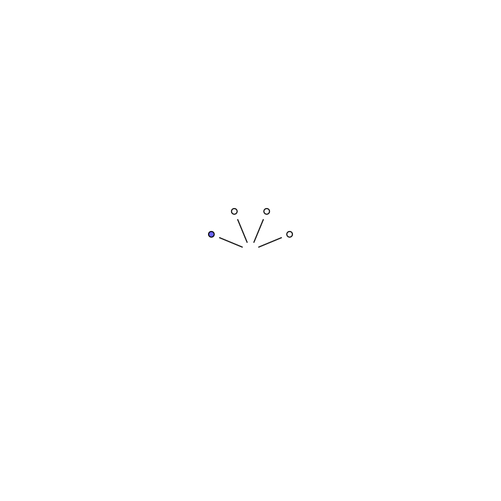

Counting possibilities
========================================================
type: lineheight
incremental: false

<p align = "center"> hypothesis: &#128309 &#9898 &#9898 &#9898 &emsp;&emsp;&emsp;&emsp;&emsp;&emsp;&emsp;&emsp;&emsp;&emsp;&emsp;&emsp;&emsp;&emsp;&emsp;&emsp; data: &#128309 &#9898</p>

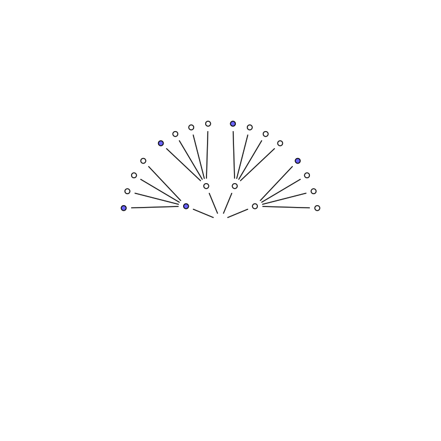

Counting possibilities
========================================================
type: lineheight
incremental: false

<p align = "center"> hypothesis: &#128309 &#9898 &#9898 &#9898 &emsp;&emsp;&emsp;&emsp;&emsp;&emsp;&emsp;&emsp;&emsp;&emsp;&emsp;&emsp;&emsp;&emsp;&emsp;&emsp; data: &#128309 &#9898 &#128309</p>

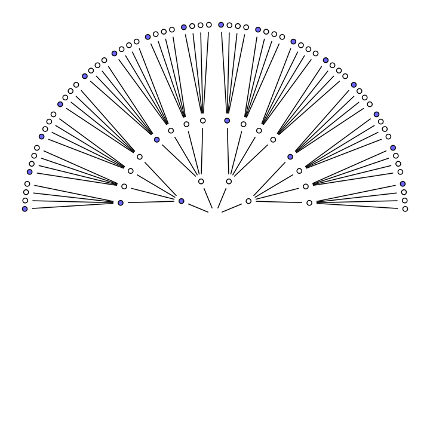

Counting possibilities
========================================================
type: lineheight
incremental: false

<p align = "center"> hypothesis: &#128309 &#9898 &#9898 &#9898 &emsp;&emsp;&emsp;&emsp;&emsp;&emsp;&emsp;&emsp;&emsp;&emsp;&emsp;&emsp;&emsp;&emsp;&emsp;&emsp; data: &#128309 &#9898 &#128309 </p>

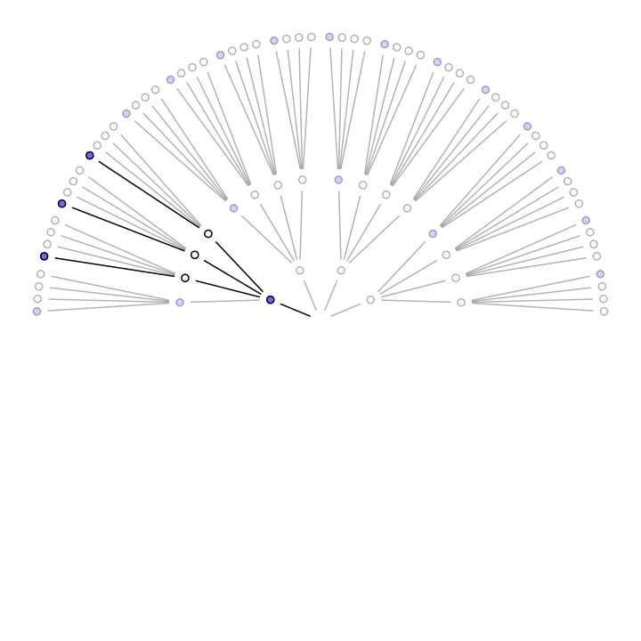

Counting possibilities
========================================================
incremental: false
type: lineheight

Under this hypothesis, $3$ paths (out of $4^{3}=64$) are consistent with the data. What about the other hypotheses?

<p align = "center"> &#9898 &#9898 &#9898 &#128309 &emsp;&emsp;&emsp;&emsp; &#9898 &#128309 &#128309 &#128309 &emsp;&emsp;&emsp;&emsp; &#9898 &#9898 &#128309 &#128309 </p>

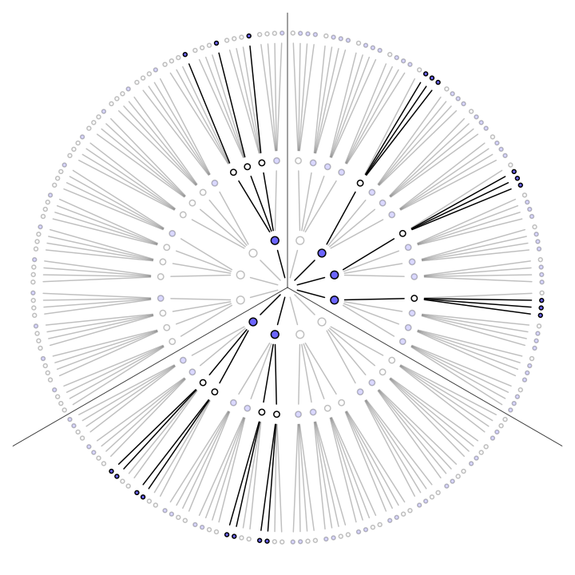

Model comparison (comparing hypotheses)
========================================================
incremental: false
type: lineheight

<p align = "center"> &#128309 &#128309 &#128309 &#9898 </p>

Given our data, this hypothesis is the most *plausible* because it's the one that **maximise** the possible ways of obtaining these data.

<center>

<style type="text/css">
.tg  {border-collapse:collapse;border-spacing:0;}
.tg td{font-family:Arial, sans-serif;font-size:30px;padding:10px 5px;border-style:solid;border-width:0px;overflow:hidden;word-break:normal;border-top-width:1px;border-bottom-width:1px;}
.tg th{font-family:Arial, sans-serif;font-size:30px;font-weight:normal;padding:10px 5px;border-style:solid;border-width:0px;overflow:hidden;word-break:normal;border-top-width:1px;border-bottom-width:1px;}
.tg .tg-gq9a{font-family:"Lucida Sans Unicode", "Lucida Grande", sans-serif !important;;text-align:center}
.tg .tg-k9ij{font-family:"Lucida Sans Unicode", "Lucida Grande", sans-serif !important;;text-align:center;vertical-align:top}
</style>
<table class="tg">
  <tr>
    <th class="tg-gq9a">Hypothesis</th>
    <th class="tg-gq9a">Ways to produce the data</th>
  </tr>
  <tr>
    <td class="tg-gq9a"> <p> &#9898 &#9898 &#9898 &#9898 </p></td>
    <td class="tg-gq9a"> 0 x 4 x 0 = 0</td>
  </tr>
  <tr>
    <td class="tg-gq9a"><p> &#128309 &#9898 &#9898 &#9898 </p></td>
    <td class="tg-gq9a">1 x 3 x 1 = 3</td>
  </tr>
  <tr>
    <td class="tg-gq9a"><p> &#128309 &#128309 &#9898 &#9898 </p></td>
    <td class="tg-gq9a">2 x 2 x 2 = 8 </td>
  </tr>
  <tr>
    <td class="tg-gq9a"><p> &#128309 &#128309 &#128309 &#9898 </p></td>
    <td class="tg-gq9a">3 x 1 x 3 = 9</td>
  </tr>
  <tr>
    <td class="tg-k9ij"><p> &#128309 &#128309 &#128309 &#128309 </p></td>
    <td class="tg-k9ij">4 x 0 x 4 = 0</td>
  </tr>
</table>

</center>

Accumulating evidence
========================================================
incremental: true
type: lineheight

We previously considered that all hypotheses were a priori equiprobable (cf. the [principle of indifference](https://en.wikipedia.org/wiki/Principle_of_indifference)).

However, we could have a priori knowledge, either coming from our beliefs, from previous data or from knowledge about usual bags of this kind.

Let's say we pull another marble out of the bag. How can we incorporate this new information into our previous analysis?

Accumulating evidence
========================================================
incremental: false
type: lineheight

We just have to apply the same strategy as previously. We can upate our previous counts by multiplying it by the new information, following the famous Bayesian dictum: "*Yesterday's posterior is today's prior*" ([Lindley, 2000](http://www.phil.vt.edu/dmayo/personal_website/Lindley_Philosophy_of_Statistics.pdf)).

<center>

<style type="text/css">
.tg  {border-collapse:collapse;border-spacing:0;}
.tg td{font-family:Arial, sans-serif;font-size:30px;padding:10px 5px;border-style:solid;border-width:0px;overflow:hidden;word-break:normal;border-top-width:1px;border-bottom-width:1px;}
.tg th{font-family:Arial, sans-serif;font-size:30px;font-weight:normal;padding:10px 5px;border-style:solid;border-width:0px;overflow:hidden;word-break:normal;border-top-width:1px;border-bottom-width:1px;}
.tg .tg-baqh{text-align:center;vertical-align:top}
.tg .tg-gq9a{font-family:"Lucida Sans Unicode", "Lucida Grande", sans-serif !important;;text-align:center}
.tg .tg-k9ij{font-family:"Lucida Sans Unicode", "Lucida Grande", sans-serif !important;;text-align:center;vertical-align:top}
</style>
<table class="tg">
  <tr>
    <th class="tg-gq9a">Hypothesis</th>
    <th class="tg-gq9a"><p>Ways to produce &#128309</p></th>
    <th class="tg-baqh">Previous counts</th>
    <th class="tg-baqh">New count</th>
  </tr>
  <tr>
    <td class="tg-gq9a"><p> &#9898 &#9898 &#9898 &#9898 </p></td>
    <td class="tg-gq9a">0</td>
    <td class="tg-baqh">0</td>
    <td class="tg-baqh">0 x 0 = 0</td>
  </tr>
  <tr>
    <td class="tg-gq9a"><p> &#128309 &#9898 &#9898 &#9898 </p></td>
    <td class="tg-gq9a">1</td>
    <td class="tg-baqh">3</td>
    <td class="tg-baqh">3 x 1 = 3</td>
  </tr>
  <tr>
    <td class="tg-gq9a"><p> &#128309 &#128309 &#9898 &#9898 </p></td>
    <td class="tg-gq9a">2</td>
    <td class="tg-baqh">8</td>
    <td class="tg-baqh">8 x 2 = 16</td>
  </tr>
  <tr>
    <td class="tg-gq9a"><p> &#128309 &#128309 &#128309 &#9898 </p></td>
    <td class="tg-gq9a">3</td>
    <td class="tg-baqh">9</td>
    <td class="tg-baqh">9 x 3 = 27</td>
  </tr>
  <tr>
    <td class="tg-k9ij"><p> &#128309 &#128309 &#128309 &#128309 </p></td>
    <td class="tg-k9ij">4</td>
    <td class="tg-baqh">0</td>
    <td class="tg-baqh">0 x 4 = 0</td>
  </tr>
</table>

</center>

Using prior information
========================================================
incremental: false
type: lineheight

Suppose that someone from the marble factory tells us that blue marbles are rare. For every bag containing three blue marbles, they make two bags that only contain two blue marbles, and three bags that only contain one blue marble. He also tells us that every bag contains at least one marble of each color.

<center>

<style type="text/css">
.tg  {border-collapse:collapse;border-spacing:0;}
.tg td{font-family:Arial, sans-serif;font-size:30px;padding:10px 5px;border-style:solid;border-width:0px;overflow:hidden;word-break:normal;border-top-width:1px;border-bottom-width:1px;}
.tg th{font-family:Arial, sans-serif;font-size:30px;font-weight:normal;padding:10px 5px;border-style:solid;border-width:0px;overflow:hidden;word-break:normal;border-top-width:1px;border-bottom-width:1px;}
.tg .tg-baqh{text-align:center;vertical-align:top}
.tg .tg-gq9a{font-family:"Lucida Sans Unicode", "Lucida Grande", sans-serif !important;;text-align:center}
.tg .tg-k9ij{font-family:"Lucida Sans Unicode", "Lucida Grande", sans-serif !important;;text-align:center;vertical-align:top}
</style>
<table class="tg">
  <tr>
    <th class="tg-gq9a">Hypothesis</th>
    <th class="tg-gq9a"><p>Previous counts</p></th>
    <th class="tg-baqh">Factory count</th>
    <th class="tg-baqh">New count</th>
  </tr>
  <tr>
    <td class="tg-gq9a"><p> &#9898 &#9898 &#9898 &#9898 </p></td>
    <td class="tg-gq9a">0</td>
    <td class="tg-baqh">0</td>
    <td class="tg-baqh">0 x 0 = 0</td>
  </tr>
  <tr>
    <td class="tg-gq9a"><p> &#128309 &#9898 &#9898 &#9898 </p></td>
    <td class="tg-gq9a">3</td>
    <td class="tg-baqh">3</td>
    <td class="tg-baqh">3 x 3 = 9</td>
  </tr>
  <tr>
    <td class="tg-gq9a"><p> &#128309 &#128309 &#9898 &#9898 </p></td>
    <td class="tg-gq9a">16</td>
    <td class="tg-baqh">2</td>
    <td class="tg-baqh">16 x 2 = 32</td>
  </tr>
  <tr>
    <td class="tg-gq9a"><p> &#128309 &#128309 &#128309 &#9898 </p></td>
    <td class="tg-gq9a">27</td>
    <td class="tg-baqh">1</td>
    <td class="tg-baqh">27 x 1 = 27</td>
  </tr>
  <tr>
    <td class="tg-k9ij"><p> &#128309 &#128309 &#128309 &#128309 </p></td>
    <td class="tg-k9ij">0</td>
    <td class="tg-baqh">0</td>
    <td class="tg-baqh">0 x 0 = 0</td>
  </tr>
</table>

</center>

From counts to probability
========================================================
incremental: true
type: lineheight

The plausibility of an hypothesis after seeing some data is proportional to the number of way this hypothesis can "produce" the data, multiplied by its *a priori* plausibility.

$$p(hypothesis|data)\propto p(data|hypothesis) \times p(hypothesis)$$

From there, we construct probabilities by standardising these plausibilities so that the sum of all plausibilities is equal to 1.

$$p(hypothesis|data) = \frac{p(data|hypothesis) \times p(hypothesis)}{sum\ of\ products}$$

From counts to probability
========================================================
incremental: false
type: lineheight

Let's define $p$ as the proportion of blue marbles.

<center>

<style type="text/css">
.tg  {border-collapse:collapse;border-spacing:0;}
.tg td{font-family:Arial, sans-serif;font-size:20px;padding:10px 5px;border-style:solid;border-width:0px;overflow:hidden;word-break:normal;border-top-width:1px;border-bottom-width:1px;}
.tg th{font-family:Arial, sans-serif;font-size:20px;font-weight:normal;padding:10px 5px;border-style:solid;border-width:0px;overflow:hidden;word-break:normal;border-top-width:1px;border-bottom-width:1px;}
.tg .tg-baqh{text-align:center;vertical-align:top}
.tg .tg-gq9a{font-family:"Lucida Sans Unicode", "Lucida Grande", sans-serif !important;;text-align:center}
.tg .tg-k9ij{font-family:"Lucida Sans Unicode", "Lucida Grande", sans-serif !important;;text-align:center;vertical-align:top}
</style>
<table class="tg">
  <tr>
    <th class="tg-gq9a">Hypothesis</th>
    <th class="tg-gq9a">p</th>
    <th class="tg-baqh">Ways to produce the data</th>
    <th class="tg-baqh">Probability</th>
  </tr>
  <tr>
    <td class="tg-gq9a"> &#9898 &#9898 &#9898 &#9898 </td>
    <td class="tg-gq9a">0</td>
    <td class="tg-baqh">0</td>
    <td class="tg-baqh">0</td>
  </tr>
  <tr>
    <td class="tg-gq9a"> &#128309 &#9898 &#9898 &#9898 </td>
    <td class="tg-gq9a">0.25</td>
    <td class="tg-baqh">3</td>
    <td class="tg-baqh">0.15</td>
  </tr>
  <tr>
    <td class="tg-gq9a"> &#128309 &#128309 &#9898 &#9898 </td>
    <td class="tg-gq9a">0.5</td>
    <td class="tg-baqh">8</td>
    <td class="tg-baqh">0.40</td>
  </tr>
  <tr>
    <td class="tg-gq9a"> &#128309 &#128309 &#128309 &#9898 </td>
    <td class="tg-gq9a">0.75</td>
    <td class="tg-baqh">9</td>
    <td class="tg-baqh">0.45</td>
  </tr>
  <tr>
    <td class="tg-k9ij"> &#128309 &#128309 &#128309 &#128309 </td>
    <td class="tg-k9ij">1</td>
    <td class="tg-baqh">0</td>
    <td class="tg-baqh">0</td>
  </tr>
</table>

</center>


```r
ways <- c(0, 3, 8, 9, 0)
(probability <- ways / sum(ways) )
```

```
[1] 0.00 0.15 0.40 0.45 0.00
```

Notations, terminology
========================================================
incremental: false
type: lineheight

- $\theta$: a parameter or vector of parameters (e.g., the proportion of blue marbles).
- $\color{orangered}{p(x\vert \theta)}$<span style="color:orangered">: the conditional probability of the data $x$ given $\theta$. Once we know $x$, can be seen as the likelihood function of $\theta$.</span>
- $\color{steelblue}{p(\theta)}$<span style="color:steelblue">: the a priori probability of $\theta$.</span>
- $\color{purple}{p(\theta \vert x)}$<span style="color:purple">: the a posteriori probability of $\theta$ (given $x$).</span>
- $\color{green}{p(x)}$<span style="color:green">: the marginal probability of $x$ (over $\theta$).</span>

<br>

$$\color{purple}{p(\theta \vert x)} = \dfrac{\color{orangered}{p(x\vert \theta)} \color{steelblue}{p(\theta)}}{\color{green}{p(x)}} = \dfrac{\color{orangered}{p(x\vert \theta)} \color{steelblue}{p(\theta)}}{\color{green}{\sum\limits_{\theta}p(x|\theta)p(\theta)}} = \dfrac{\color{orangered}{p(x\vert \theta)} \color{steelblue}{p(\theta)}}{\color{green}{\int\limits_{\theta}p(x|\theta)p(\theta)\mathrm{d}x}} \propto \color{orangered}{p(x\vert \theta)} \color{steelblue}{p(\theta)}$$

Probability axioms (Kolmogorov, 1933)
========================================================
incremental: true
type: lineheight

A probability is **a numerical value** assigned to an event $A$, this event being a possibility of an ensemble $\Omega$ (the ensemble of all possible events). Probabilities conform to the following axioms (the third axiom is only valid for mutually exclusive events):

+ **Non-negativity.** $P(A_{i}) \geq 0$
+ **Normalisation.** $P(\Omega) = 1$
+ **Additivity.** $P(A_{1} \lor A_{2}) = P(A_{1}) + P(A_{2})$

This last axiom is also known as the **sum rule**, and can be generalised to non mutually exclusive events: $P(A_{1} \lor A_{2}) = P(A_{1}) + P(A_{2}) - P(A_{1} \land A_{2})$.

Deriving Bayes theorem
========================================================
incremental: true
type: lineheight

From these axioms (and the definitions of joint, marginal and conditional probability) derives the **product rule**, which states that:

$$p(x,y) = p(x|y)p(y) = p(y|x)p(x)$$

Then, restating the above equality,

$$p(y|x)p(x) = p(x|y)p(y)$$

And dividing each side by $p(x)$ gives Bayes theorem, which can be written as:

$$p(y|x) = \dfrac{p(x|y)p(y)}{p(x)}$$

Or, in plain English (replacing $x$ by *data* and $y$ by *hypothesis*):

$$p(hypothesis|data) = \frac{p(data|hypothesis) \times p(hypothesis)}{sum\ of\ products}$$

Bayesian inference
========================================================
type: lineheight
incremental: true

For each statistical problem, we will follow three steps (from [Gelman et al., 2013](http://www.stat.columbia.edu/~gelman/book/)):

- Building the model (the history of the data): likelihood + priors

- Updating the model with the information contained in the data using Bayes theorem (aka computing or approximating the posterior probability)

- Evaluating the model, its fit, its assumptions, summarising the results, readjusting the model

> "*Bayesian inference is really just counting and comparing of possibilities [...] in order to make good inference about what actually happened, it helps to consider everything that could have happened."* ([McElreath, 2015](http://xcelab.net/rm/statistical-rethinking/))

Aparté: Probabilistic interpretations
========================================================
incremental: true
type: lineheight

What is the probability...

* Of getting head when flipping a coin?
* That I learn something new during this talk?

Do these two questions refer to the same concept of *probability*?


Aparté: Probabilistic interpretations
========================================================
incremental: true
type: lineheight

> **Epistemic probability**
- Every probability is conditional on some available information (e.g., premises or data).
- Probabilities as a way of quantifying uncertainty.
- Logical interpretation, Bayesian interpretation.

<hr style="height:20pt; visibility:hidden;" />

> **Physical probability**
- Probabilities depend on a state of the world, on physical characteristics. They are independent of knowledge or uncertainty.
- Classical interpretation, frequentist interpretation.</center>

Aparté: Probabilistic interpretations
========================================================
incremental: false
type: lineheight

+ Classical interpretation (Laplace, Bernouilli, Leibniz)
+ **Frequentist interpretation** (Venn, Reichenbach, von Mises)
+ Propensity interpretation (Popper, Miller)
+ Logical interpretation (Keynes, Carnap)
+ **Bayesian interpretation** (Jeffreys, de Finetti, Savage)

*[Follow this link for more details...](http://plato.stanford.edu/entries/probability-interpret/)*

Theoretical background - Multilevel linear models
========================================================
incremental: true
type: center

Linear models
========================================================
type: lineheight
incremental: true

The sequel is an excerpt from this [blogpost](https://www.barelysignificant.com/post/glm/): "*Using R to make sense of the generalised linear model*".

> "[Statistical] models are devices that connect theories to data. A model is an instanciation of a theory as a set of probabilistic statements" ([Rouder, Morey, & Wagenmakers, 2016](https://www.collabra.org/articles/10.1525/collabra.28/)).

The usual linear model is of the following form.

$$
\begin{aligned}
y_{i} &\sim \mathrm{Normal}(\mu_{i}, \sigma) \\
\mu_{i} &= \alpha + \beta \cdot x_{i} \\
\end{aligned}
$$

Where, in Bayesian terms, the first line of the model corresponds to the *likelihood* of the model, which is the assumption made about the data generation process. We make the assumption that the outcomes $y_{i}$ are normally distributed around a mean $\mu_{i}$ with some error $\sigma$. This is equivalent to say that the errors are normally distributed around $0$.

Linear models
========================================================
type: lineheight
incremental: true

Of course, the distributional assumption is not restricted to be Gaussian, and can be adapted to whatever distribution that makes sense in consideration of the data at hand. Generalising to other distributions, the generalised linear model can be rewritten as:

$$
\begin{aligned}
y_{i} &\sim \mathrm{D}(f(\eta_{i}), \theta) \\
\eta &= \mathbf{X} \beta \\
\end{aligned}
$$

Where the response $y_{i}$ is **predicted** through the linear combination $\eta$ of predictors transformed by the inverse link function $f$, assuming a certain distribution $D$ for $y$ (also called the *family*), and family-specific parameters $\theta$ ([Bürkner, 2017](https://www.jstatsoft.org/article/view/v080i01)).

Linear models
========================================================
type: lineheight
incremental: true

Below, we illustrate a simple Gaussian linear model using the `Howell1` dataset from the `rethinking` package ([McElreath, 2016](https://github.com/rmcelreath/rethinking)), which contains data about 544 individuals, including height (centimeters), weight (kilograms), age (years) and gender (0 indicating female and 1 indicating male).

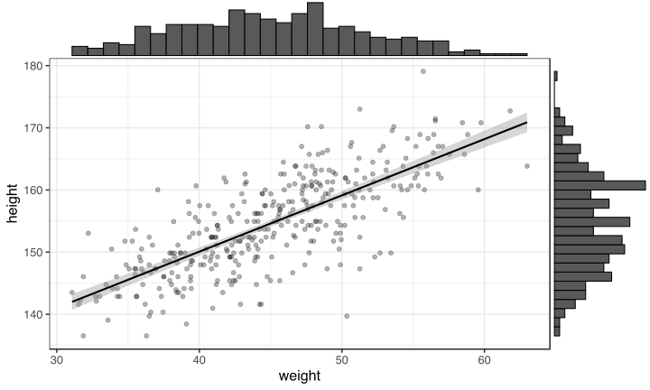

Linear models
========================================================
type: lineheight
incremental: true

A quick visual exploration of the dataset reveals a positive relationship between height and weight. The above plotted regression line corresponds to the following model, where we assume a Normal likelihood:

$$
\begin{aligned}
\text{height}_{i} &\sim \mathrm{Normal}(\mu_{i}, \sigma) \\
\mu_{i} &= \alpha + \beta \cdot \text{weight}_{i} \\
\end{aligned}
$$

This model can be fitted easily in `R` with the following syntax.


```r
(mod1 <- lm(height ~ weight, data = d) )
```

```

Call:
lm(formula = height ~ weight, data = d)

Coefficients:
(Intercept)       weight  
    113.879        0.905  
```

<!--
The intercept (113.879) represents the predicted height when weight is at 0 (which makes no much sense in our case), whereas the slope (0.905) represents the change in height when weight increases by one unit (i.e., one kilogram).
-->

Multilevel modelling
========================================================
type: lineheight
incremental: true

Multilevel models are multi-level generalisations of linear models.

$$
\begin{align}
\text{Level 1}: y_{i} &\sim \mathrm{Normal}(\mu_{i},\sigma) \\
\mu_{i} &= \alpha_{\text{group}[i]} + \beta \cdot x_{i} \\
\text{Level 2}: \alpha_{\text{group}} &\sim \mathrm{Normal}(\alpha,\sigma_{\text{group}}) \\
\alpha &\sim \mathrm{Normal}(0,10) \\
\sigma_{\text{group}} &\sim \mathrm{HalfCauchy}(0,10) \\
\sigma &\sim \mathrm{HalfCauchy}(0,10) \\
\end{align}
$$

The prior on the group intercepts ($\alpha_{\text{group}}$) is a function of two parameters ($\alpha$ and $\sigma_{\text{café}}$). These parameters are called **hyper-parameters**, as they are parameters for parameters. Their priors are called **hyperpriors**. There are two levels in the model...

========================================================
incremental: true
type: lineheight

<embed src="http://mfviz.com/hierarchical-models/" width=1600 height=1000 />

Shrinkage magic (Efron & Morris, 1977)
========================================================
type: lineheight
incremental: true


The James-Stein estimator is defined as $z = \bar{y} + c(y - \bar{y})$, where $\bar{y}$ is the grand average, $y$ an individual estimation and $c$ a constant, the "shrinking factor" ([Efron & Morris, 1977](http://statweb.stanford.edu/~ckirby/brad/other/Article1977.pdf)).

Shrinkage magic (Efron & Morris, 1977)
========================================================
type: lineheight
incremental: false

The James-Stein estimator is determined both by the variability in the measure (e.g., its standard deviation, influencing the shrinking factor $c$) and by its distance to the average estimation (i.e., $y - \bar{y}$). In other words, extreme observations are less trusted. Shrinkage therefore acts as **a safeguard against overfitting** in multilevel models.


The problem with posteriors
========================================================
type: lineheight
incremental: true

Relatively simple problems like estimating the mean $\mu$ and standard deviation $\sigma$ of a Normal distribution with conjugate Gaussian priors have a closed form solution:

$$
\color{purple}{p(\mu, \sigma | x)} = \frac{\prod_{i} \color{orangered}{\mathrm{Normal}(x_{i}|\mu, \sigma)}\color{steelblue}{\mathrm{Normal}(\mu|0,10)\mathrm{Uniform}(\sigma|0,50)}}
{\color{green}{\int \int \prod_{i} \mathrm{Normal}(x_{i}|\mu,\sigma)\mathrm{Normal}(\mu|0,10)\mathrm{Uniform}(\sigma|0,50)d\mu d\sigma}}
$$

$$
\color{purple}{p(\mu, \sigma | x)} \propto \prod_{i} \color{orangered}{\mathrm{Normal}(x_{i}|\mu, \sigma)}\color{steelblue}{\mathrm{Normal}(\mu|0,10)\mathrm{Uniform}(\sigma|0,50)}
$$

However, for models containing more parameters or featuring non-conjugate priors, the integral (the *marginalising constant* in green) may be very difficult or impossible to compute.

Sampling the unknowns
========================================================
type: lineheight
incremental: true

Instead of computing the marginalising constant, we will **approximate** the shape of the posterior distribution. Different methods exist...

* Grid sampling: computing the exact value of the posterior probability in a finite number of points (can be computationnaly very expensive)

* Sampling from the distribution using Markov Chain Monte-Carlo algorithms (much more efficient than grid approximation)...


========================================================
incremental: true
type: lineheight

<embed src="https://chi-feng.github.io/mcmc-demo/app.html?algorithm=RandomWalkMH&target=standard" width=1600 height=1000 />

========================================================
incremental: true
type: lineheight

<embed src="https://chi-feng.github.io/mcmc-demo/app.html?algorithm=HamiltonianMC&target=standard" width=1600 height=1000 />

Theoretical background - Introducing brms
========================================================
incremental: true
type: center

Under the hood: Stan
========================================================
incremental: false
type: lineheight

`Stan` is a probabilistic programming language written in `C++`. It implements several MCMC algorithms such as HMC, NUTS, L-BFGS...


```r
data {
  int<lower=0> J; // number of schools 
  real y[J]; // estimated treatment effects
  real<lower=0> sigma[J]; // s.e. of effect estimates 
}

parameters {
  real mu; 
  real<lower=0> tau;
  real eta[J];
}

transformed parameters {
  real theta[J];
  for (j in 1:J)
    theta[j] = mu + tau * eta[j];
}

model {
  target += normal_lpdf(eta | 0, 1);
  target += normal_lpdf(y | theta, sigma);
}
```

Bayesian Regression Models using Stan
========================================================
incremental: true
type: lineheight

The `brms` package ([Bürkner, 2017](https://www.jstatsoft.org/article/view/v080i01)) allows fitting complex Bayesien multilevel linear and non-linear models in `Stan` using an intuitive high-level syntax (similar to the syntax of `lme4`). For instance, the following model:

$$
\begin{align}
y_{i} &\sim \mathrm{Normal}(\mu_{i}, \sigma) \\
\mu_{i} &= \alpha + \alpha_{subject[i]} + \alpha_{item[i]} + \beta \cdot x_{i} \\
\end{align}
$$

can be fitted using `brms` (as with `lme4`) as follows:


```r
brm(y ~ x + (1|subject) + (1|item), data = d, family = gaussian() )
```

Example: Analysing the sleepstudy dataset
========================================================
incremental: true
type: lineheight

The `sleepstudy` dataset data from the study described in [Belenky et al. (2003)](https://www.ncbi.nlm.nih.gov/pubmed/12603781). It describes the average reaction time per day for subjects in a sleep deprivation study. On day 0 the subjects had their normal amount of sleep. Starting that night they were restricted to 3 hours of sleep per night. The observations represent the average reaction time on a series of tests given each day to each subject.


```r
library(lme4)
data(sleepstudy)
head(sleepstudy, 10)
```

```
   Reaction Days Subject
1  249.5600    0     308
2  258.7047    1     308
3  250.8006    2     308
4  321.4398    3     308
5  356.8519    4     308
6  414.6901    5     308
7  382.2038    6     308
8  290.1486    7     308
9  430.5853    8     308
10 466.3535    9     308
```

Example: Analysing the sleepstudy dataset
========================================================
incremental: false
type: lineheight


```r
sleepstudy %>%
    ggplot(aes(x = Days, y = Reaction) ) +
    geom_smooth(method = "lm", colour = "black") +
    geom_point() +
    facet_wrap(~Subject, nrow = 2) +
    theme_bw(base_size = 10)
```

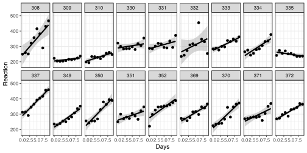

Example: Analysing the sleepstudy dataset
========================================================
incremental: true
type: lineheight

The `get_prior()` function returns a list of each prior to be specified given some `formula` and some data, as well as the default priors (if any) used by `brms`.


```r
get_prior(Reaction ~ Days + (1 + Days|Subject), sleepstudy)
```

```
                   prior     class      coef   group resp dpar nlpar bound
1                                b                                        
2                                b      Days                              
3                 lkj(1)       cor                                        
4                              cor           Subject                      
5  student_t(3, 289, 59) Intercept                                        
6    student_t(3, 0, 59)        sd                                        
7                               sd           Subject                      
8                               sd      Days Subject                      
9                               sd Intercept Subject                      
10   student_t(3, 0, 59)     sigma                                        
```

Example: Analysing the sleepstudy dataset
========================================================
incremental: true
type: lineheight

Priors can be specified in several ways, explained in the documentation (accessible by typing `?prior`).


```r
prior1 <- c(
    prior(normal(200, 10), class = Intercept),
    prior(normal(0, 10), class = b, coef = Days),
    prior(cauchy(0, 10), class = sigma),
    prior(lkj(2), class = cor)
    )
```


```r
mod1 <- brm(
    Reaction ~ Days + (1 + Days | Subject),
    data = sleepstudy,
    family = gaussian(),
    prior = prior1,
    warmup = 2000, iter = 1e4,
    chains = 2
    )
```

Example: Analysing the sleepstudy dataset
========================================================
incremental: true
type: lineheight


```r
library(broom)
tidy(mod1, parameters = c("^b_", "^sd_", "sigma"), prob = 0.95)
```

```
                   term    estimate std.error      lower      upper
1           b_Intercept 216.4717794 15.692978 183.884886 245.176242
2                b_Days   0.6364845  3.592791  -6.706415   7.312768
3 sd_Subject__Intercept  45.4243335 15.329213  22.097091  81.733911
4      sd_Subject__Days  12.3482112  4.001762   6.185603  21.853544
5                 sigma  25.6538785  1.502110  22.925426  28.826775
```

<br>


Some elements of syntax
========================================================
incremental: true
type: lineheight

The `brms` package features the same syntax as `R` base functions such as `lm()` or functions from the `lme4` package.


```r
Reaction ~ Days + (1 + Days | Subject)
```

The left-hand side of the formula defines the *outcome* (i.e., what is predicted). The `brms` package also allows fitting multivariate (i.e., with several outcomes) models by combining these outcomes with `mvbind()`:


```r
mvbind(Reaction, Memory) ~ Days + (1 + Days | Subject)
```

The right-hand side of the formula defines the *predictors* (i.e., what is used to predict the outcome.s). Note that an intercept is implicitly assumed by default in `R`, so that the two notations below correspond to the same model.


```r
mvbind(Reaction, Memory) ~ Days + (1 + Days | Subject)
mvbind(Reaction, Memory) ~ 1 + Days + (1 + Days | Subject)
```

Some elements of syntax
========================================================
incremental: true
type: lineheight

To fit a model without an intercept (because we can), we need to explicitly specify it as follows.


```r
mvbind(Reaction, Memory) ~ 0 + Days + (1 + Days | Subject)
```

The first part of the right-hand side of the formula corresponds to the *constant effects* (aka *fixed effects*), whereas the second part (inside parentheses) corresponds to *varying effects* (aka *random effects*).


```r
mvbind(Reaction, Memory) ~ Days + (1 | Subject)
mvbind(Reaction, Memory) ~ Days + (Days | Subject)
```

The first above model contains an intercept varying by `Subject`. The second models contains in addition a slope varying by `Subject`.

Some elements of syntax
========================================================
incremental: true
type: lineheight

When we include several varying effects (e.g., both a varying intercept and a varying slope), `brms` estimates the correlation between each pair of random effect by default. If we are not interested in estimating this correlation, we need to remove this parameter from the model (that is equivalent to fixing its value to 0) by using `||`.


```r
mvbind(Reaction, Memory) ~ Days + (1 + Days || Subject)
```

The previous models assumed a Gaussian reponse distribution. We can change this assumption by using the `family` argument.


```r
brm(Reaction ~ 1 + Days + (1 + Days | Subject), family = lognormal() )
```

Helpful brms functions
========================================================
incremental: true
type: lineheight


```r
# Specify the model using R formulas:
brmsformula(formula, ...)

# Generate the Stan code:
make_stancode(formula, ...)
stancode(fit)

# Generate the data passed to Stan:
make_standata(formula, ...)
standata(fit)

# Handle priors:
get_prior(formula, ...)
set_prior(prior, ...)

# Generate expected values and predictions:
fitted(fit, ...)
predict(fit, ...)
marginal_effects(fit, ...)

# Model comparison:
loo(fit1, fit2, ...)
bayes_factor(fit1, fit2, ...)
model_weights(fit1, fit2, ...)

# Hypothesis testing:
hypothesis(fit, hypothesis, ...)
```

Worked example #1 - Experimental absenteeism
========================================================
incremental: true
type: center

Worked example #1 - Experimental absenteeism
========================================================
incremental: true
type: lineheight

Working with human subjects requires a minimum amount of reciprocal cooperation. But that requirement is not always fullfilled. A non-negligible proportion of students that register for a Psychology experiment in our lab do not show up for the experiment... We wanted to estimated the propobability that a registered participant would come to the lab, depending on whether s.he received a reminder by email (this example is presented in more depth in two blogposts, available [here](http://www.barelysignificant.com/post/absenteeism/) and [there](http://www.barelysignificant.com/post/absenteeism2/)).


```r
library(tidyverse)

data <- read.csv("absenteeism.csv")
data %>% sample_frac %>% head(10)
```

```
   reminder researcher presence absence total
1        -1          8       38      54    92
2        -1          9       31      65    96
3         1          7       64      16    80
4        -1          7        3      77    80
5        -1          6       34      54    88
6         1          6       82       6    88
7        -1          2       53      59   112
8         1          8       81      11    92
9        -1         10       23      58    81
10        1          9       89       7    96
```

Worked example #1 - Experimental absenteeism
========================================================
incremental: false
type: lineheight

In other words, we want to estimate the probability $p_{i}$ of the participant being present. We assume $y_{i}$ (i.e., ...) to be binomial distributed with probability $p_{i}$.

$$y_{i} \sim \mathrm{Binomial}(n_{i}, p_{i})$$

The probability $p_{i}$ is predicted via a linear combination of some predictors:

$$logit(p_{i}) = \alpha_{researcher_{[i]}} + \beta_{researcher_{[i]}} \times \text{reminder}_{i}$$

Where $logit(\cdot)$ is a **link function**...

Worked example #1 - Experimental absenteeism
========================================================
incremental: false
type: lineheight

We can extend this model on several levels, allowing the average probability of presence (i.e., the intercept) and the effect of the reminder (i.e., the slope) to vary by researcher.

$$
\begin{aligned}
y_{i} &\sim \mathrm{Binomial}(n_{i}, p_{i}) \\
logit(p_{i}) &= \alpha_{researcher_{[i]}} + \beta_{researcher_{[i]}} \times \text{reminder}_{i} \\
\begin{bmatrix}
\alpha_{\text{researcher}} \\
\beta_{\text{researcher}} \\
\end{bmatrix}
&\sim \mathrm{MVNormal}\bigg(\begin{bmatrix} \alpha \\ \beta \end{bmatrix}, \textbf{S}\bigg) \\
\textbf{S} &=
\begin{pmatrix}
\sigma_{\alpha} & 0 \\
0 & \sigma_{\beta} \\
\end{pmatrix}
\textbf{R} \begin{pmatrix}
\sigma_{\alpha} & 0 \\
0 & \sigma_{\beta} \\
\end{pmatrix} \\
\alpha &\sim \mathrm{Normal}(0, 10) \\
\beta &\sim \mathrm{Normal}(0, 10) \\
(\sigma_{\alpha}, \sigma_{\beta}) &\sim \mathrm{HalfCauchy}(0, 10) \\
\textbf{R} &\sim \mathrm{LKJcorr}(2) \\
\end{aligned}
$$

Worked example #1 - Experimental absenteeism
========================================================
incremental: true
type: lineheight

Il existe plusieurs manières de spécifier les priors (cf. `?prior`).


```r
prior2 <- c(
    prior(normal(0, 10), class = Intercept, coef = ""),
    prior(cauchy(0, 10), class = sd),
    prior(normal(0, 10), class = b),
    prior(lkj(2), class = cor)
    )
```


```r
mod2 <- brm(
    presence | trials(total) ~ 1 + reminder + (1 + reminder|researcher), 
    family = binomial(link = "logit"),
    prior = prior2,
    data = data,
    sample_prior = TRUE,
    warmup = 2000, iter = 1e4,
    cores = parallel::detectCores(),
    control = list(adapt_delta = 0.95)
    )
```

Worked example #1 - Experimental absenteeism
========================================================
incremental: false
type: lineheight


```r
mod2 %>%
    plot(
        combo = c("hist", "trace"), widths = c(1, 1.5),
        theme = theme_bw(base_size = 16)
        )
```


Worked example #1 - Experimental absenteeism
========================================================
incremental: true
type: lineheight

Attention, les estimations ci-dessous sont dans l'espace log-odds... 


```r
tidy(mod2, parameters = c("^b_", "^sd_"), prob = 0.95)
```

```
                      term  estimate std.error     lower     upper
1              b_Intercept 0.8381505 0.2968037 0.2444227 1.4345906
2               b_reminder 1.6103499 0.1790956 1.2628285 1.9799340
3 sd_researcher__Intercept 0.8707734 0.2854908 0.4813294 1.5745211
4  sd_researcher__reminder 0.4790520 0.1766399 0.2298742 0.9017351
```

Afin de pouvoir les interpréter il faut appliquer la transformation logit-inverse. Par exemple, la probabilité de présence en moyenne (i.e., quel que soit le chercheur et pour toutes conditions confondues) est égale à $p = \exp(\alpha) / (1 + \exp(\alpha) )$.


```r
a <- fixef(mod2)[1] # extract the intercept
exp(a) / (1 + exp(a) ) # equivalent to plogis(a)
```

```
[1] 0.6980755
```

Worked example #1 - Experimental absenteeism
========================================================
incremental: true
type: lineheight

On s'est ensuite interrogé sur l'effet du mail de rappel. Ici encore, on ne peut pas interpréter la pente directement... mais on sait que $\text{exp}(\beta)$ nous donne un [odds ratio](https://en.wikipedia.org/wiki/Odds_ratio).


```r
fixef(mod2)[2, c(1, 3, 4)] %>% exp
```

```
Estimate     Q2.5    Q97.5 
5.004562 3.535407 7.242265 
```

Ce ratio est environ égal à 4.99 (95% HDI [3.51, 7.19]). On peut l'interpréter en disant qu'il est cinq fois plus probable que le participant soit présent si on a envoyé un mail de rappel...

Plotting the predictions of the model
========================================================
incremental: true
type: lineheight

Une manière de représenter les prédictions du modèle est de plotter directement quelques échantillons issus de la distribution *a posteriori*. On appelle ce genre de plot un *spaghetti plot*.

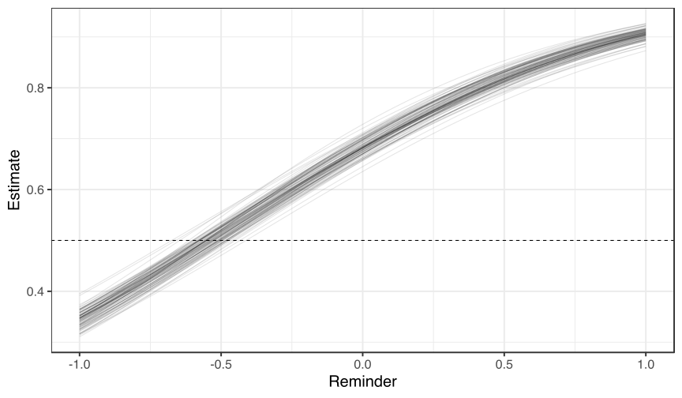

Plotting the predictions of the model
========================================================
incremental: false
type: lineheight


```r
data %>%
    group_by(researcher, total) %>%
    data_grid(reminder = seq_range(reminder, n = 1e2) ) %>%
    add_fitted_samples(mod2, newdata = ., n = 100, scale = "linear") %>%
    mutate(estimate = plogis(estimate) ) %>%
    ggplot(aes(x = reminder, y = estimate, group = .iteration) ) +
    geom_hline(yintercept = 0.5, lty = 2) +
    geom_line(aes(y = estimate, group = .iteration), size = 0.5, alpha = 0.1) +
    facet_wrap(~researcher, nrow = 2) +
    theme_bw(base_size = 20)+ labs(x = "Reminder", y = "Estimate")
```


Hypothesis test - 1
========================================================
incremental: true
type: lineheight

Plusieurs manières de tester des hypothèses avec `brms`. La fonction `hypothesis()` calcule un *evidence ratio* (équivalent au Bayes Factor). Lorsque l'hypothèse testée est une hypothèse ponctuelle (on teste une valeur précise du paramètre, e.g., $\theta = 0$), cet *evidence ratio* est approximé via la méthode de **Savage-Dickey**. Cette méthode consiste simplement à comparer la densité du point testé accordée par le prior à la densité accordée par la distribution *a posteriori*.


```r
(hyp1 <- hypothesis(mod2, "reminder = 0") )
```

```
Hypothesis Tests for class b:
      Hypothesis Estimate Est.Error CI.Lower CI.Upper Evid.Ratio Post.Prob
1 (reminder) = 0     1.61      0.18     1.26     1.98          0         0
  Star
1    *
---
'CI': 90%-CI for one-sided and 95%-CI for two-sided hypotheses.
'*': For one-sided hypotheses, the posterior probability exceeds 95%;
for two-sided hypotheses, the value tested against lies outside the 95%-CI.
Posterior probabilities of point hypotheses assume equal prior probabilities.
```

```r
1 / hyp1$hypothesis$Evid.Ratio
```

```
[1] 2.85731e+22
```

Hypothesis test - 1
========================================================
incremental: false
type: lineheight


```r
plot(hyp1, theme = theme_bw(base_size = 20) )
```

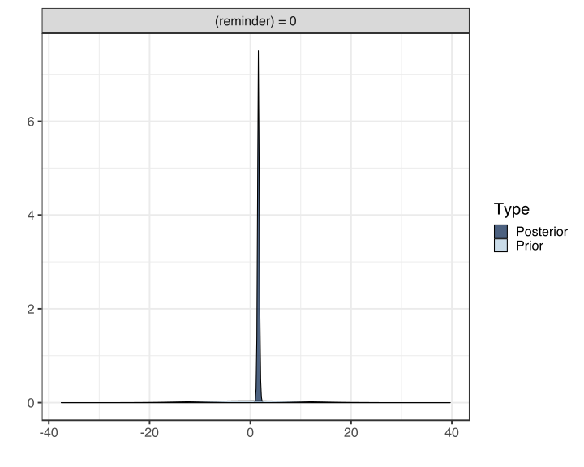

Comparing the posterior to the prior
========================================================
incremental: false
type: lineheight


```r
data.frame(prior = hyp1$prior_samples$H1, posterior = hyp1$samples$H1) %>%
    gather(type, value) %>%
    ggplot(aes(x = value) ) +
    geom_histogram(bins = 50, alpha = 0.8) +
    geom_vline(xintercept = 0, lty = 2, size = 1) +
    facet_wrap(~type, scales = "free") +
    xlab(expression(beta[reminder]) ) +
    theme_bw(base_size = 20)
```

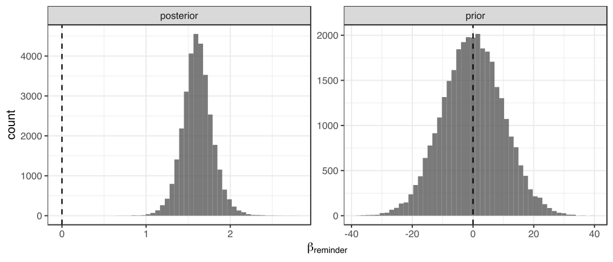

Hypothesis test - 2
========================================================
incremental: true
type: lineheight

Une deuxième solution consiste à étendre l'approche par comparaison de modèles. Tester une hypothèse revient à comparer deux modèles: un modèle avec l'effet d'intérêt et un modèle sans l'effet d'intérêt.


```r
prior3 <- c(
    prior(normal(0, 10), class = Intercept, coef = ""),
    prior(cauchy(0, 10), class = sd),
    prior(lkj(2), class = cor) )

mod2 <- brm(presence | trials(total) ~ 1 + reminder + (1 + reminder|researcher), 
    family = binomial(link = "logit"),
    prior = prior2,
    data = data,
    # this line is important for bridgesampling
    save_all_pars = TRUE,
    warmup = 2000, iter = 1e4,
    cores = parallel::detectCores(),
    control = list(adapt_delta = 0.95) )

mod3 <- brm(presence | trials(total) ~ 1 + (1 + reminder|researcher), 
    family = binomial(link = "logit"),
    prior = prior3,
    data = data,
    save_all_pars = TRUE,
    warmup = 2000, iter = 1e4,
    cores = parallel::detectCores(),
    control = list(adapt_delta = 0.95) )
```

Hypothesis test - 2
========================================================
incremental: true
type: lineheight

On peut ensuite comparer la vraissemblance marginale de ces modèles, c'est à dire calculer un Bayes Factor. Le package `brms` implémente la méthode `bayes_factor()` qui repose sur une approximation de la vraissemblance marginale via `bridgesampling` ([Gronau & Singmann, 2017](https://arxiv.org/abs/1710.08162)).


```r
bayes_factor(mod2, mod3)
```

```
Iteration: 1
Iteration: 2
Iteration: 3
Iteration: 4
Iteration: 1
Iteration: 2
Iteration: 3
Iteration: 4
Iteration: 5
Iteration: 6
Iteration: 7
```

```
Estimated Bayes factor in favor of bridge1 over bridge2: 3206.02509
```

Posterior predictive checking
========================================================
incremental: true
type: lineheight

Une autre manière d'examiner les capacités de prédiction d'une modèle est le *posterior preditive checking* (PPC). L'idée est simple: il s'agit de comparer les données observées à des données simulées à partir de la distribution *a posteriori*. Une fois qu'on a une distribution *a posteriori* sur $\theta$, on peut simuler des données à partir de la *posterior predictive distribution*:

$$p(\widetilde{y} | y) = \int p(\widetilde{y} | \theta) p(\theta | y) d \theta$$

Si le modèle est un bon modèle, il devrait pouvoir générer des données qui ressemblent aux données qu'on a observées (e.g., [Gabry, Simpson, Vehtari, Betancourt, & Gelman, 2017](https://arxiv.org/abs/1709.01449)).

Posterior predictive checking
========================================================
incremental: true
type: lineheight

On représente ci-dessous la distribution de nos données.


```r
data %>%
    ggplot(aes(x = presence / total) ) +
    geom_density(fill = "grey20") +
    theme_bw(base_size = 20)
```

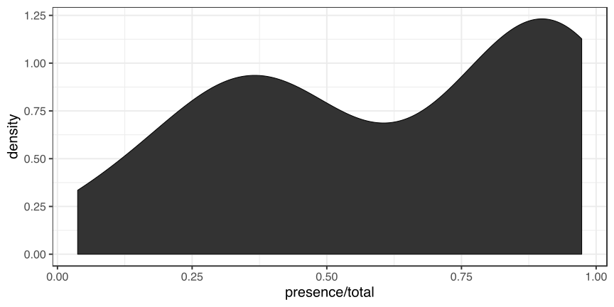

Posterior predictive checking
========================================================
incremental: true
type: lineheight

Cette procédure est implémentée dans `brms` via la méthode `pp_check()`, qui permet de réaliser de nombreux checks divers. Par exemple, ci-dessous on compare les prédictions *a posteriori* (n = 100) aux données observées.


```r
pp_check(mod2, nsamples = 1e2) + theme_bw(base_size = 20)
```


Posterior predictive checking
========================================================
incremental: false
type: lineheight


```r
pp_check(mod2, nsamples = 1e3, type = "stat_2d") + theme_bw(base_size = 20)
```

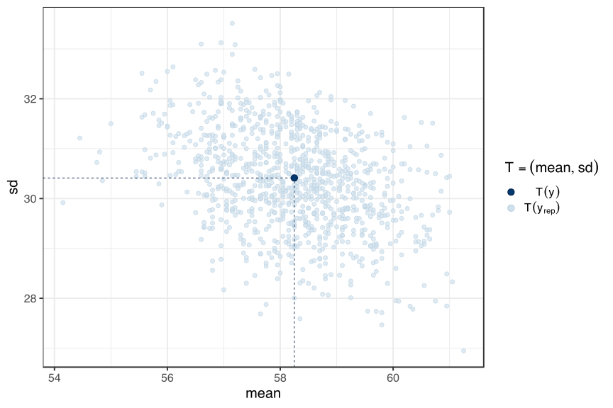

Adjusting Stan's behaviour
========================================================
incremental: true
type: lineheight

En fittant des modèles un peu compliqués, il se peut que vous obteniez des messages d'avertissement du genre "`There were x divergent transitions after warmup`". Dans cette situation, on peut ajuster le comportement de `Stan` directement dans un appel de la fonction `brm()` en utilisant l'argument `control`.


```r
mod2 <- brm(
    presence | trials(total) ~ 1 + reminder + (1 + reminder|researcher), 
    family = binomial(link = "logit"),
    prior = prior2,
    data = data,
    warmup = 2000, iter = 1e4,
    cores = parallel::detectCores(), # using all availables cores
    control = list(adapt_delta = 0.95) # adjusting the delta step size
    )
```

On peut par exemple augmenter le pas de l'algorithme, via `adapt_delta` (par défaut fixé à 0.8), ce qui ralentira probablement l'échantillonnage mais améliorera la validité des échantillons obtenus. Plus généralement, soyez attentifs aux messages d'erreur et d'avertissement générés par `brms`.

Worked example #2 - Meta-analysis
========================================================
incremental: true
type: center

Worked example #2 - Meta-analysis
========================================================
incremental: false
type: lineheight

A meta-analysis is simply an analysis of analyses. It is (or can be) a linear model similar to those discussed previously, excepts that observations are (usually) already summarised by an effect size. We can treat these effect sizes as observations with a known variation (i.e., estimated and reported in the original articles included in the meta-analysis).

There are (at least) two types of meta-analytic models:

- **Constant-effect (aka fixed-effect) meta-analysis**: we consider that the effect size estimated in each study refers to the same population effect size

- **Varying-effect (aka random effect) meta-analysis**: we model the variabillity between studies and we exploit the similarities in extent groups (e.g., experiments from the same study or team) to improve the estimation of the overall effect (cf. the shrinkage magic). Note that a "fixed-effect" model" can be considerd as a "random-effect" model with a fixed $\tau = 0$.

Worked example #2 - Meta-analysis
========================================================
incremental: false
type: lineheight

This dataset contains the results of 32 experiments aiming to assess the role of biomechanical constraints on the visual estimation of distances ([Molto, Nalborczyk, Palluel-Germain & Morgado, 2019](https://psyarxiv.com/2zutq/)).


```r
d <- read.csv("meta.csv")
head(d, 15)
```

```
                              study experiment           yi         vi
1                   Costello (2015)          1  0.735209366 0.29846545
2                   Costello (2015)          2  0.925134052 0.04796738
3           Durgin & Russell (2008)          1 -0.124624069 0.17928177
4         Hutchison & Loomis (2006)          1 -0.128328394 0.10001576
5         Hutchison & Loomis (2006)          2  0.350487089 0.05963093
6             Kirsch & Kunde (2012)          1  0.609278390 0.31866670
7            Kirsch & Kunde (2013a)          1  0.511022255 0.16231426
8            Kirsch & Kunde (2013a)          2  0.407867633 0.04216585
9            Kirsch & Kunde (2013b)          1  0.229159882 0.32082216
10           Kirsch & Kunde (2013b)          2 -0.223592130 0.08876431
11           Kirsch & Kunde (2013b)          3  0.145865089 0.10038189
12 Lessard, Linkenauger & P. (2009)          1  0.172318408 0.09078810
13             Morgado & al. (2013)          1  0.002778791 0.13837508
14         Osiurak & Morgado (2012)          1  0.460865217 0.22233808
15  Proffitt, S, B & Epstein (2003)          1  0.351381281 0.10386001
```

Worked example #2 - Meta-analysis
========================================================
incremental: true
type: lineheight

We can write a first model as follows.

$$
\begin{aligned}
y_{j} &\sim \mathrm{Normal}(\mu_{j}, \sigma_{j}) \\
\mu_{j} &= \alpha + \alpha_{study[j]} \\
\alpha_{study[j]} &\sim \mathrm{Normal}(0, \tau_{s}) \\
\alpha &\sim \mathrm{Normal}(0, 1) \\
\tau_{s} &\sim \mathrm{HalfCauchy}(0, 1) \\
\end{aligned}
$$

Where $\sigma_{j}^2 = v_{j}$ is the variance of the effect in the $j\text{th}$ study and $\alpha$ is the population effect size. The index $\alpha_{study[j]}$ represents the average effect size in the $j\text{th}$ study. In addition to the sample variance $\sigma_{j}^2$ (which is known), we also estimate the variability of the effect between studies $\text{Var}(\alpha_{study}) = \tau_{s}^{2}$ (level 2).

Worked example #2 - Meta-analysis
========================================================
incremental: false
type: lineheight

The previous model can be extended to more than two levels to take into account the dependencies structures existing in the data. Indeed, each individual study (i.e., each published paper) may contain several experiments. We could expect experiments from the same study to be more similar than experiments from different studies...


Worked example #2 - Meta-analysis
========================================================
incremental: true
type: lineheight

We can write this model on three levels, as below.

$$
\begin{aligned}
y_{ij} &\sim \mathrm{Normal}(\mu_{ij}, \sigma_{ij}) \\
\mu_{ij} &= \alpha + \alpha_{study[j]} + \alpha_{experiment[ij]} \\
\alpha_{study[j]} &\sim \mathrm{Normal}(0, \tau_{s}) \\
\alpha_{experiment[ij]} &\sim \mathrm{Normal}(0, \tau_{e}) \\
\alpha &\sim \mathrm{Normal}(0, 1) \\
\tau_{e}, \tau_{s} &\sim \mathrm{HalfCauchy}(0, 1) \\
\end{aligned}
$$

In addition to the residual variability $\sigma_{ij}$, we also estimate two other sources of variation: the variation of effects between different experiments from the same study $\text{Var}(\alpha_{experiment}) = \tau_{e}^{2}$ (level 2) and the variation of the effect between different studies $\text{Var}(\alpha_{study}) = \tau_{s}^{2}$ (level 3).

Worked example #2 - Meta-analysis
========================================================
incremental: false
type: lineheight

This model is easily fitted with `brms`.


```r
prior4 <- c(
    prior(normal(0, 1), coef = intercept),
    prior(cauchy(0, 1), class = sd)
    )

mod4 <- brm(
    yi | se(sqrt(vi) ) ~ 0 + intercept + (1|study) + (1|experiment),
    data = d,
    prior = prior4,
    save_all_pars = TRUE,
    warmup = 2000, iter = 1e4,
    cores = parallel::detectCores(),
    control = list(adapt_delta = .99)
    )
```

Worked example #2 - Meta-analysis
========================================================
incremental: false
type: lineheight


```r
summary(mod4)
```

```
 Family: gaussian 
  Links: mu = identity; sigma = identity 
Formula: yi | se(sqrt(vi)) ~ 0 + intercept + (1 | study) + (1 | experiment) 
   Data: d (Number of observations: 32) 
Samples: 4 chains, each with iter = 10000; warmup = 2000; thin = 1;
         total post-warmup samples = 32000

Group-Level Effects: 
~experiment (Number of levels: 4) 
              Estimate Est.Error l-95% CI u-95% CI Rhat Bulk_ESS Tail_ESS
sd(Intercept)     0.35      0.26     0.06     1.04 1.00     9590    11464

~study (Number of levels: 19) 
              Estimate Est.Error l-95% CI u-95% CI Rhat Bulk_ESS Tail_ESS
sd(Intercept)     0.22      0.10     0.03     0.44 1.00     9186     8131

Population-Level Effects: 
          Estimate Est.Error l-95% CI u-95% CI Rhat Bulk_ESS Tail_ESS
intercept     0.42      0.22    -0.02     0.89 1.00    10069    12107

Samples were drawn using sampling(NUTS). For each parameter, Eff.Sample 
is a crude measure of effective sample size, and Rhat is the potential 
scale reduction factor on split chains (at convergence, Rhat = 1).
```

Worked example #2 - Meta-analysis
========================================================
incremental: false
type: lineheight


```r
mod4 %>% plot(combo = c("hist", "trace"), theme = theme_bw(base_size = 18) )
```


Worked example #2 - Meta-analysis
========================================================
incremental: false
type: lineheight


Further resources
========================================================
incremental: false
type: lineheight

A list of blogposts about `brms`: https://paul-buerkner.github.io/blog/brms-blogposts/

The article introducing `brms` ([Bürkner, 2017](https://www.jstatsoft.org/article/view/v080i01)) as well as the "advanced" version ([Bürkner, 2018](https://journal.r-project.org/archive/2018/RJ-2018-017/index.html)).

A tutorial on ordinal logistic regression models using `brms` ([Bürkner & Vuorre, 2018](https://journals.sagepub.com/doi/10.1177/2515245918823199)).

Our tutorial paper on Bayesian multilevel models using `brms` ([Nalborczyk et al., 2019](https://pubs.asha.org/doi/10.1044/2018_JSLHR-S-18-0006), [preprint](https://psyarxiv.com/guhsa/)) and another one ([Vasishth et al., 2018](https://www.sciencedirect.com/science/article/pii/S0095447017302310)).

The materials of our 2019 doctoral course "Introduction à la modélisation statistique bayésienne" (in French, [slides + code](https://github.com/lnalborczyk/IMSB2019)).

Take-home messages
========================================================
incremental: true
type: lineheight

<link rel="stylesheet" href="http://maxcdn.bootstrapcdn.com/font-awesome/4.3.0/css/font-awesome.min.css">
<link rel="stylesheet" href="https://cdn.rawgit.com/jpswalsh/academicons/master/css/academicons.min.css">

<link rel = "stylesheet" href = "css/font-awesome.css"/>
<link rel = "stylesheet" href = "css/academicons.css"/>

* **Bayesian inference**: A general statistical inference framework relying on the use of Bayes theorem (i.e., basic probability rules). Can be seen as an extension of logic, where conclusions are derived from premises (prior information) and evidence (information contained in the data).

* **Multilevel models**: Hierarchical (or not) extensions of the linear model taking into account complex data structures to provide more precise estimations via partial pooling (cf. the concept of *shrinkage*).

* **The brms package**: Bayesian equivalent of `lme4` (but way more flexible), providing an interface to the probabilistic language `Stan`. Allows fitting complex nonlinear multilevel models.

<br>

<i class="fa fa-twitter"></i> &nbsp; [<font size="7">lnalborczyk</font>](https://twitter.com/lnalborczyk) &nbsp; <i class="fa fa-github"></i> &nbsp; [<font size="7">lnalborczyk</font>](https://github.com/lnalborczyk) &nbsp; <i class = "ai ai-osf"></i> &nbsp; [<font size="7">osf.io/ba8xt</font>](https://osf.io/profile/) &nbsp; <i class = "fa fa-globe"></i> &nbsp; [<font size="7">www.barelysignificant.com</font>](http://www.barelysignificant.com)

<script src="https://ajax.googleapis.com/ajax/libs/jquery/3.1.1/jquery.min.js"></script>
<script>

for(i=0;i<$("section").length;i++) {
if(i==0) continue
$("section").eq(i).append("<p style='font-size:xx-large;position:fixed;right:200px;bottom:50px;'>" + i + "</p>")
}

</script>
