```{r xaringan-themer, include = FALSE} 
library(xaringanthemer)

mono_accent(
    base_color = "#1c5253",
    header_font_google = google_font("Josefin Sans"),
    text_font_google = google_font("Montserrat", "300", "300i"),
    code_font_google = google_font("Droid Mono"),
    header_h1_font_size = "40px",
    header_h2_font_size = "35px",
    header_h3_font_size = "30px",
    text_font_size = "20px",
    code_font_size = "15px"
    )
```

# Overview

```{r setup, include = FALSE}
library(tidyverse)
library(icons)
library(knitr)
library(keras)

# setting up knitr options
knitr::opts_chunk$set(
  cache = TRUE, echo = TRUE, warning = FALSE, message = FALSE,
  fig.align = "center", dev = "svg", out.width = "75%"
  )

# for interactive stuffs
options(htmltools.dir.version = FALSE)

# setting seed for reproducibility
set.seed(666)
```

```{r xaringanExtra-clipboard, echo = FALSE}
xaringanExtra::use_clipboard()
```

```{r xaringan-tachyons, echo = FALSE}
xaringanExtra::use_tachyons()
```

1. Theoretical background
    + What is deep learning?
    + Deep learning recipes (e.g., backpropagation, overfitting)

2. Practical part / tutorial
    + Worked example #1: Fashion MNIST classification using a fully connected network
    + Worked example #2: Surface EMG signals classification using a 1d CNN

---
class: inverse, center, middle

<iframe width="100%" height="100%" src="https://www.youtube.com/embed/cQ54GDm1eL0" title="YouTube video player" frameborder="0" allow="accelerometer; autoplay; clipboard-write; encrypted-media; gyroscope; picture-in-picture" allowfullscreen></iframe>

---
class: center, middle
background-image: url(figures/reface.jpeg)
background-position: center
background-size: cover

---

# What is deep learning?

AI includes symbolic expression, logic rules, as well as handcrafted nested if-else statements. Machine learning includes supervised and unsupervised learning models, generalised linear models, tree-based methods, SVMs, clustering methods, etc. Deep learning is the focus of this talk and mostly (but not only) covers deep artificial neural networks (figure from [Sebastian Raschka](https://github.com/rasbt/stat453-deep-learning-ss20)).

```{r, echo = FALSE, fig.align = "center", out.width = "50%"}
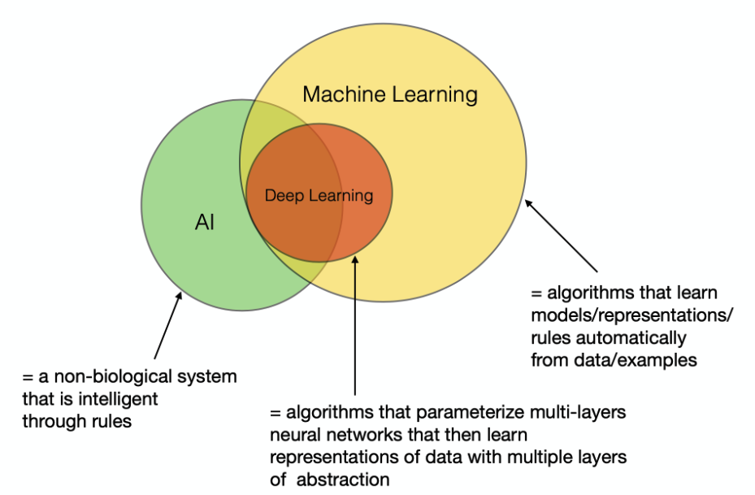
```

---

# Why deep learning?

Engineering features by hand can be long and tedious... Can we learn the underlying features (at multiple levels of abstraction) directly from the data?

```{r, echo = FALSE, fig.align = "center", out.width = "75%"}
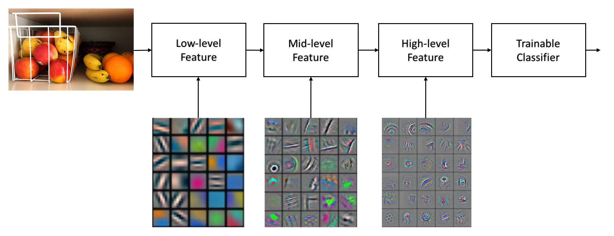
```

---

# What's deep in deep learning?

.bg-washed-green.b--dark-green.ba.bw2.br3.shadow-5.ph4.mt5[
Representation learning is a set of methods that allows a machine to
be fed with raw data and to automatically discover the representations
needed for detection or classification. Deep-learning methods are
representation-learning methods with multiple levels of representation [...]

.tr[
— LeCun, Y., Bengio, Y., & Hinton, G. (2015). Deep learning. Nature, 521(7553), 436-444.
]]

---

# Why now and why so succesfull?

```{r, echo = FALSE, fig.align = "center", out.width = "75%"}
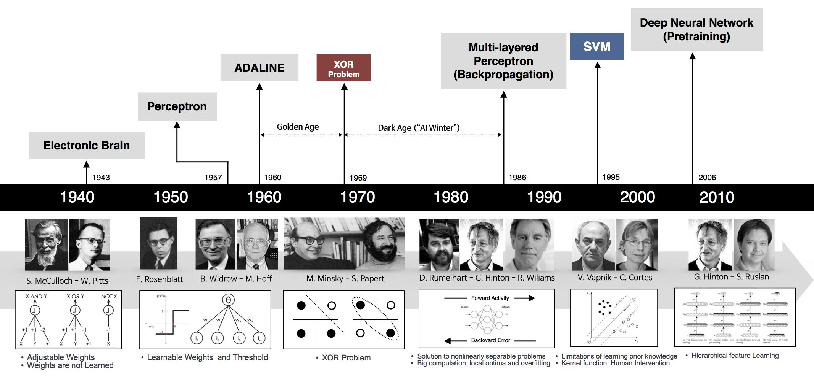
```

Figure from http://beamandrew.github.io/deeplearning/2017/02/23/deep_learning_101_part1.html.

---

# Why now and why so succesfull?

- Big **data**: Large (high-quality and labelled) datasets, easier collection and storage
- Big **hardware**: Graphics Processing Units (GPUs), massive parallelisation
- Big **software**: Improved techniques (e.g., activation functions, regularisation), new models, new toolboxes

```{r, echo = FALSE, fig.align = "center", out.width = "50%"}

```

---

# Biological motivation

In essence, each neuron takes information from other neurons, processes them, and then produces an output. One could imagine that certain neurons output information based on raw sensory inputs, other neurons build higher representations on that, and so on until one gets outputs that are significant at a higher level. Figure taken from this [post](https://rstudio-pubs-static.s3.amazonaws.com/146706_0754aef7cdab424ebe0ac4e0e5aa362e.html).

```{r, echo = FALSE, fig.align = "center", out.width = "75%"}
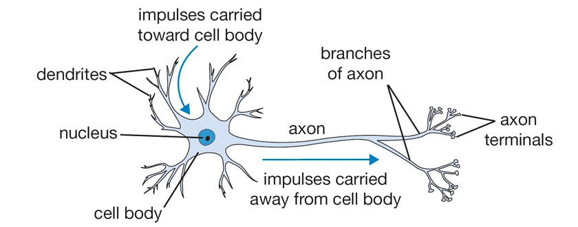
```

---

# The Perceptron: forward propagation

Figure taken from from http://introtodeeplearning.com.

```{r, echo = FALSE, fig.align = "center", out.width = "75%"}
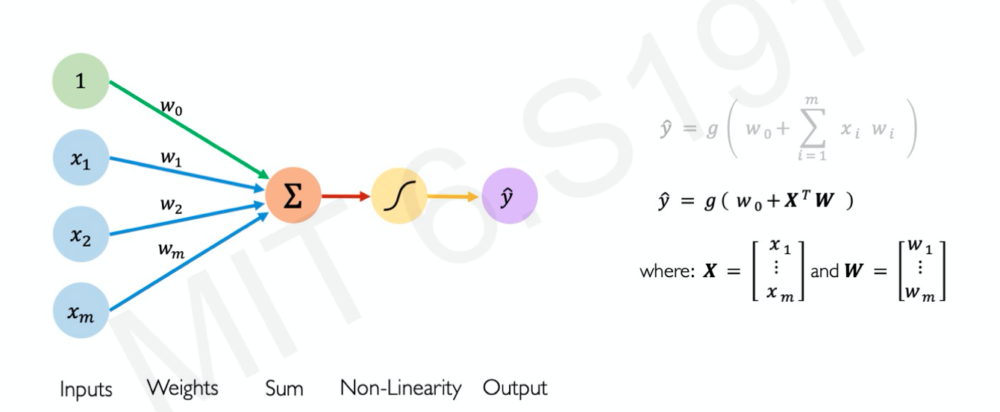
```

---

# Common activation functions

```{r, echo = FALSE, fig.align = "center", out.width = "100%"}
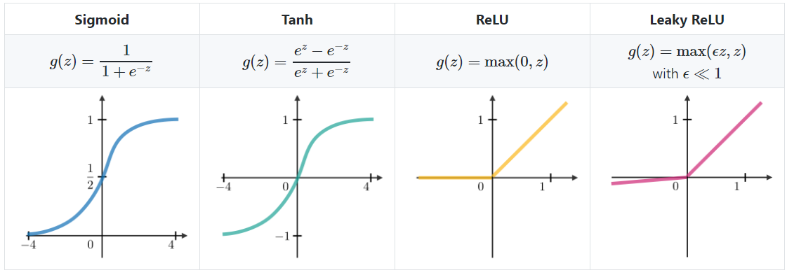
```

---

# The importance of (non-linear) activation functions

```{r linear, out.width = "50%", fig.asp = 0.5}
library(tidyverse) # for data wrangling & visualisation

n <- 1e3
df <- data.frame(x1 = runif(n), x2 = runif(n) )
df$y <- factor(ifelse(df$x1 - df$x2 > 0, -1, 1), levels = c(-1, 1) )

df %>%
  ggplot(aes(x = x1, y = x2, color = y) ) +
  geom_point(show.legend = FALSE) +
  theme_bw(base_size = 12) +
  labs(x = "Variable 1", y = "Variable 2")
```

---

# The importance of (non-linear) activation functions

```{r nonlinear, out.width = "50%", fig.asp = 0.5}
n <- 1e3
df <- data.frame(x1 = runif(n), x2 = runif(n) )
df$y <- factor(ifelse(0.3 < sqrt(df$x1^2 + df$x2^2) & sqrt(df$x1^2 + df$x2^2) < 0.8, -1, 1), levels = c(-1, 1) )

df %>%
  ggplot(aes(x = x1, y = x2, color = y) ) +
  geom_point(show.legend = FALSE) +
  theme_bw(base_size = 12) +
  labs(x = "Variable 1", y = "Variable 2")
```

---

# Going deeper

```{r, echo = FALSE, fig.align = "center", out.width = "75%"}
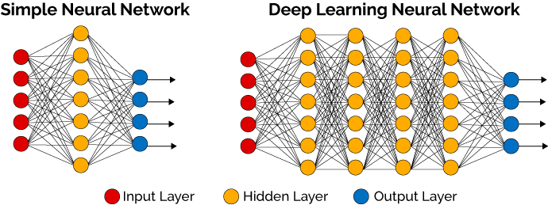
```

---

# Universal Approximation Theorem

Deep neural networks work so well because they are **universal function approximators**. Specifically, we know that for any nonconstant, bounded, and monotonically-increasing continuous function, there exists a feedforward network with a linear output layer and at least one hidden layer with any "squashing" activation function (such as logistic sigmoid) that can approximate this function with any desired nonzero error.

Hornik, K., Stinchcombe, M., & White, H. (1989). Multilayer feedforward networks are universal approximators. Neural networks, 2(5), 359-366.

.bg-washed-green.b--dark-green.ba.bw2.br3.shadow-5.ph4.mt5[
A feedforward network with a single layer is sufficient to represent any function, but the layer may be infeasibly large and may fail to learn and generalize correctly.

.tr[
— Goodfellow, I., Bengio, Y., & Courville A. (2016). Deep learning. MIT Press.
]]

---
class: middle, center

# How does it learn?

---

# Building an intuition

Example and figures taken from https://e2eml.school/how_backpropagation_works.html. We want to take the perfect shower, but our shower head is finicky... We have two valves that can be used to adjust the water flow rate: the shower handle and the main valve for the house. We are re going to use backpropagation to get them adjusted just right.

```{r, echo = FALSE, fig.align = "center", out.width = "50%"}

```

---

# Sensitivity

What's the change in water flow rate when we change either one of these valves? In other words, how *sensitive* is the water flow rate to either one of these valve settings? We can measure how a one-unit change in the valve settings affect the flow rate (e.g., in units of cubic feet per minute). For instance, if we change the shower handle position from 4 to 8 and notice that the shower flow rate changes from 3 to 5, the sensitivity of shower flow rate to shower handle position is $(5-3) / (8-4) = 2 / 4 = 0.5$.

```{r, echo = FALSE, fig.align = "center", out.width = "50%"}
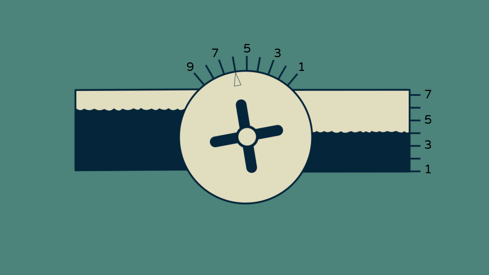
```

---

# Sensitivity (with math)

Sensitivity can be defined as the change in one thing per a one unit change in another thing. For instance, change in shower flow rate per one unit change in the shower handle position. To make things simple, we will call the shower flow rate $y$ and the shower handle position $h$. We call the flow rate in the house $x$ and the position of the main valve $m$.

```{r, echo = FALSE, fig.align = "center", out.width = "50%"}
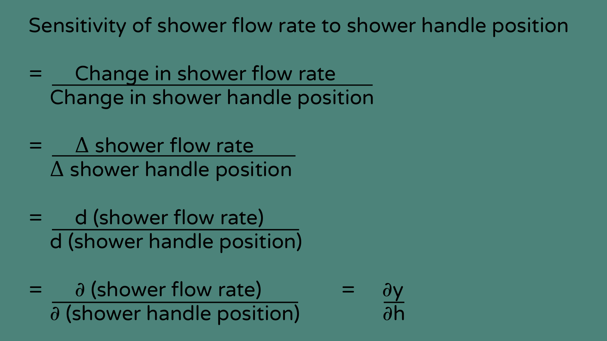
```

---

# Working backward

Last slide, we have defined the shower flow rate as $y$ and the shower handle position $h$. We called the flow rate in the house $x$ and the position of the main valve $m$. The sensitivity of the shower flow rate to the shower handle position was $\partial{y} / \partial{h}$. What's the sensitivity for the main house valve?

--

By dividing our change in $x$ by our change in $m$, we can calculate the sensitivity of house flow rate to main valve setting, $\partial{x} / \partial{h}$.

--

The output flow rate of the showerhead $y$ depends both on the shower handle setting $h$ and the house flow rate flowing into the shower handle $x$. We can put a number on this sensitivity too. Adjusting the main valve $m$ changes the house flow rate $x$ which indirectly affects the shower flow rate $y$. By measuring the change in the house flow rate $x$ and the corresponding change in the flow rate through the showerhead $y$, we can find the sensitivity of the shower flow rate to increases in the house flow rate, $\partial{y} / \partial{x}$.

---

# Chain rule

```{r, echo = FALSE, fig.align = "center", out.width = "33%"}

```

We have a few different sensitivities, $\partial{y} / \partial{h}$, $\partial{y} / \partial{x}$, and $\partial{x} / \partial{m}$. But we do not know the sensitivity of the shower flow rate with respect to the main valve, $\partial{y} / \partial{m}$... but imagine we had measured $\partial{x} / \partial{m}$ to be two and $\partial{y} / \partial{x}$ to be $1/4$. We can multiply the two together to get the net result: $2 \times 1 / 4 = 1 / 2$.

$$
\partial{y} / \partial{m} = \partial{y} / \partial{x} \times \partial{x} / \partial{m}
$$

--

In other words, we can chain together sensitivities by multiplying them. This is known as the **chain rule**, which states that we can (for instance) compute partial derivatives for each layer of a network as $\partial \text{layer}_{2} \times \partial \text{layer}_{1} \Rightarrow \partial f(g(x)) \times \partial g(x)$.

---

# How far from ideal is the shower?

Let's say that our ideal shower flow rate is a special value of $y$, which we call $y'$. We can calculate our deviation, how far away from this ideal value we are, by taking $y - y'$. To express our unhappiness with the current state of the water flow, we can use how far away it is from the ideal: the absolute value of $y - y'$ or $|y - y'|$. We'll call this $E$, our error, and we would like it to be zero. Our goal will be to adjust our valves $m$ and $h$ to make our shower flow rate perfect, drive $y$ to be $y'$, and make $E$ go to zero.

```{r, echo = FALSE, fig.align = "center", out.width = "50%"}
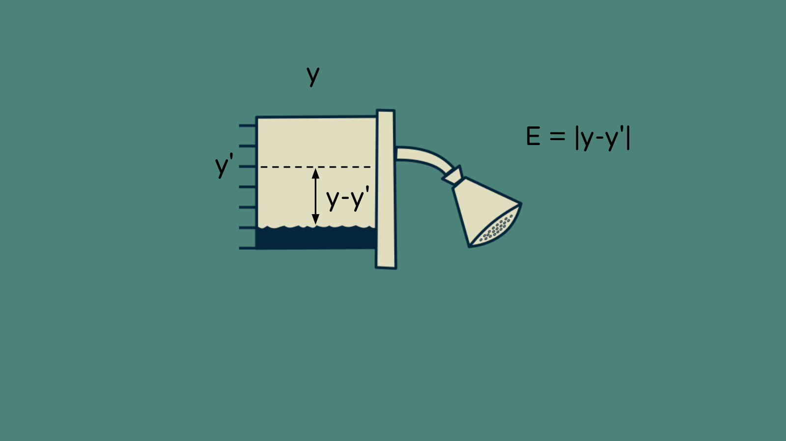
```

---

# How far from ideal is the shower?

We can compute the sensitivity of $E$ to changes in our shower flow rate. The derivative of an absolute value is straightforward: $\partial{E} / \partial{y} = 1$ if $y$ is greater than $y'$ and it's $-1$ if it's less than $y'$. It's not actually defined at $y = y'$, but we can just declare it to be zero. Now we can chain this with our other sensitivities to find the sensitivity of the error to our two valve positions.

```{r, echo = FALSE, fig.align = "center", out.width = "50%"}
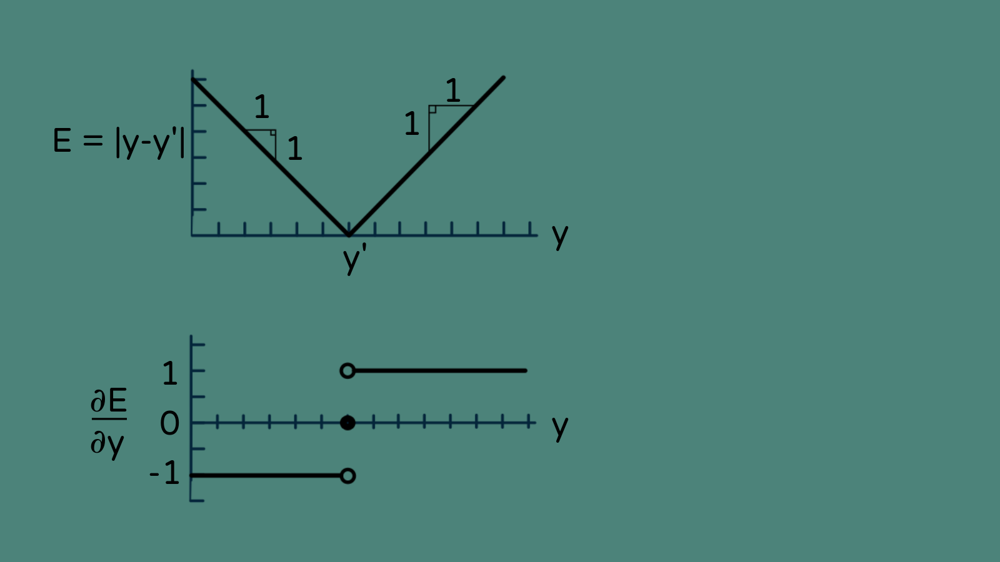
```

---

# How much should each valve be adjusted?

Now we have one thing we want to change, the error, and two ways to change it. How do we go about it? This is where backpropagation comes in. The secret is to weight the adjustment (to each valve) by the sensitivity... The safest way to handle an uncertain, nonlinear, dynamic situation like this is to take tiny steps. Instead of trying to move the whole distance all at once, we move 1/100, or 1/1000, or 1/10000 of the way (the specific distance is governed by the learning rate $\eta$).

```{r, echo = FALSE, fig.align = "center", out.width = "50%"}
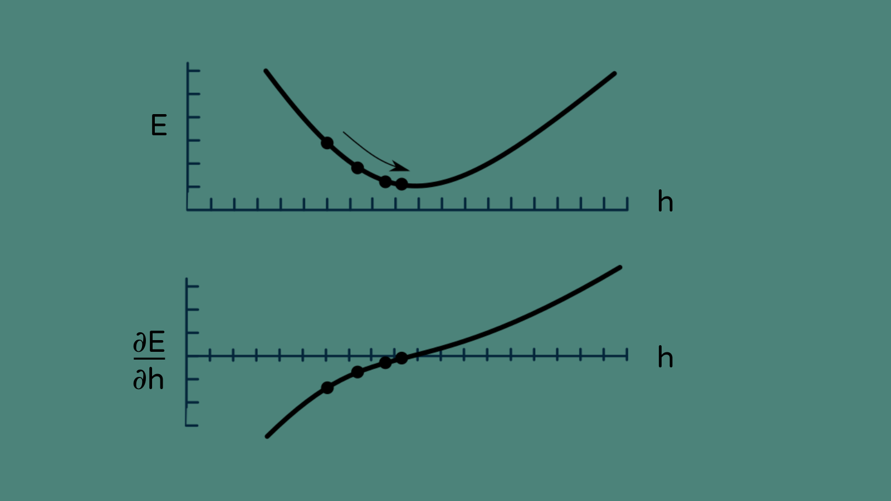
```

---

# Making the first adjustment

Now we finally know everything we need to adjust our valves and get our shower set up. Each valve adjustment will be proportional to the sensitivity of the error to that valve, and in the opposite direction (we want $E$ to go down, not up). We multiply that by our learning rate, $\eta$. So for our first iteration, our adjustment to the shower handle, $\Delta \text{h}1$, is $−\eta \times \partial{E} / \partial{y} \times \partial{y} / \partial{h}$. Similarly, the change to the main valve, $\Delta \text{m}1$, is $−\eta \times \partial{E} / \partial{y} \times \partial{y} / \partial{x} \times \partial{x} / \partial{m}$.

```{r, echo = FALSE, fig.align = "center", out.width = "50%"}
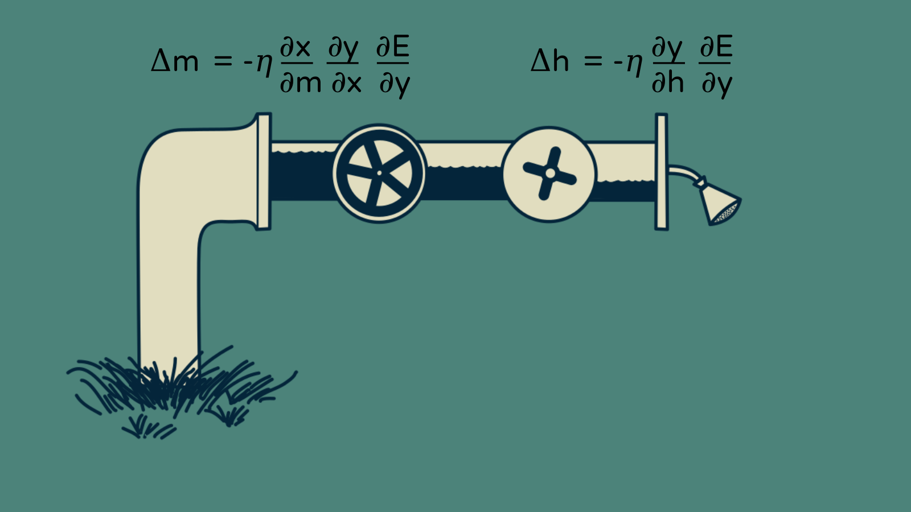
```

---

# Backpropagation in the real world

We have seen how to apply backpropagation to two nodes (weights). In real settings, our network can have thousands or millions of parameters to adjust. However, the principles are the same.

- Chain sensitivities back through the network
- Make a small update
- Observe the effects
- Update the sensitivities throughout the network
- And repeat

---

# Backpropagation in the real world

Figure taken from https://baptiste-monpezat.github.io/blog/stochastic-gradient-descent-for-machine-learning-clearly-explained. In this animation, the blue line corresponds to stochastic gradient descent and the red one is a basic gradient descent algorithm. 

```{r, echo = FALSE, fig.align = "center", out.width = "75%"}
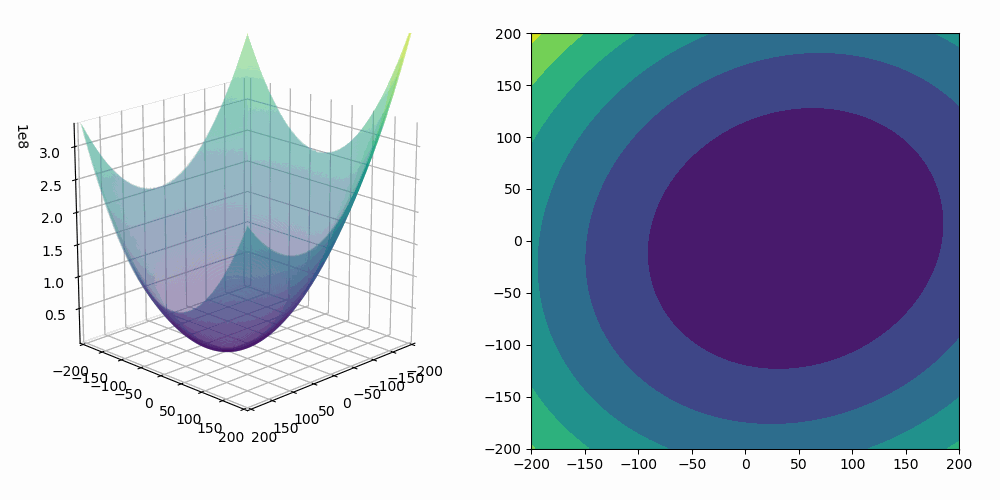
```

---

# Fighting overfitting

More complex models (i.e., models with more parameters) will always fit the *training* data better. How can we ensure that we learn enough (but not too much) from these training data, so that the model is able to generalise well to unseen data?

```{r, echo = FALSE, fig.align = "center", out.width = "75%"}
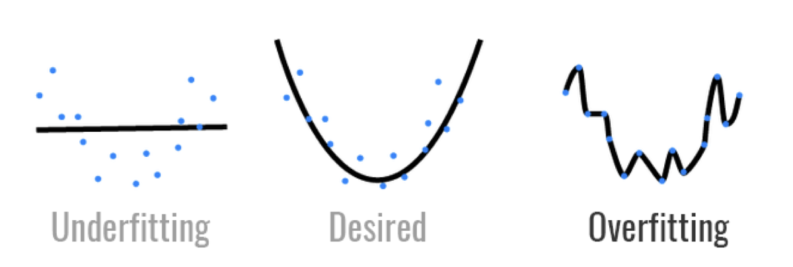
```

---

# Fighting overfitting

Using **regularisation techniques** (i.e., modification of the learning algorithm to reduce testing error but not training error) such as **dropout**: during training, we randomly set some activations (weights) to zero. This effectively forces the network not to rely on any given node.

```{r, echo = FALSE, fig.align = "center", out.width = "75%"}
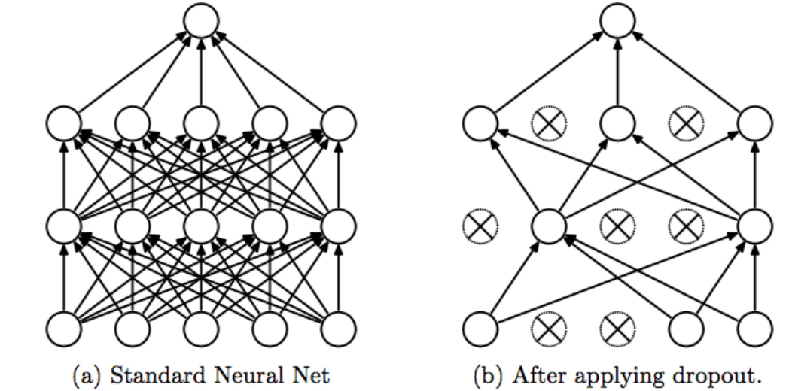
```

---

# Fighting overfitting

We can also use **early stopping**. Basically, stopping the training before it overfits.

```{r, echo = FALSE, fig.align = "center", out.width = "75%"}
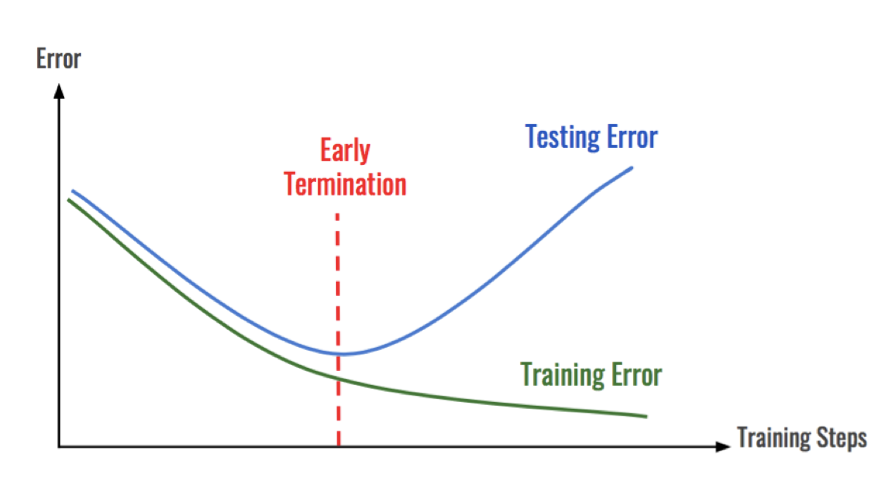
```

---

# Aparté: Tensors

Tensor is the general name for multidimensional array data. A 1d-tensor is simply a vector, a 2d-tensor is a matrix, a 3d-tensor is a cube. We can image a 4d-tensor as a vector of cubes, a 5d-tensor as a matrix of cubes, and a 6d-tensor as a cube of cubes.

```{r tensor, echo = FALSE, fig.align = "center", out.width = "50%"}
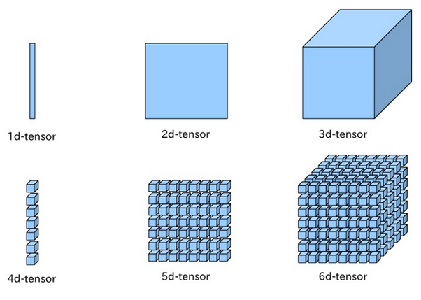
```

---
class: middle, center

# Practical part

---
class: middle, center

# Worked example #1: Fashion MNIST classification using a fully connected network

---

# Installing and loading packages

```{r, eval = FALSE}
# installing tensorflow
install.packages("tensorflow")
library(tensorflow)
install_tensorflow()

# installing keras
install.packages("keras")
library(keras)
install_keras()
```

---

# MNIST

- National Institute of Standards and Technology (NIST) database
- MNIST (Modified NIST)
- 60.000 training images and 10.000 testing images
- normalised to fit into a 28-by-28 pixel bounding box

```{r, echo = FALSE, fig.align = "center", out.width = "40%"}
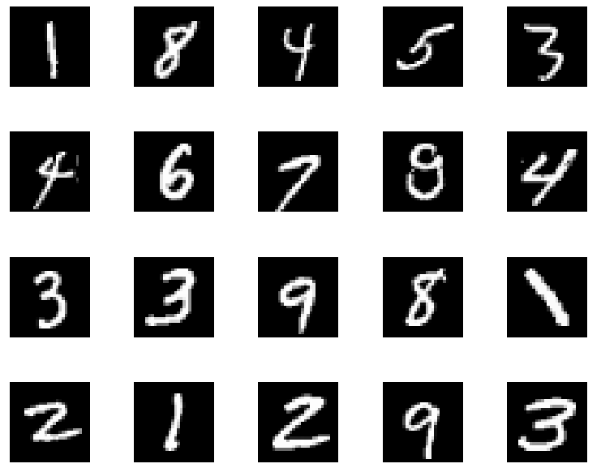
```

---

# Fashion MNIST data

We will use the Fashion MNIST dataset, which contains 70.000 grayscale images in 10 categories. The images show individual articles of clothing at low resolution (28 by 28 pixels).

```{r, echo = FALSE, fig.align = "center", out.width = "40%"}
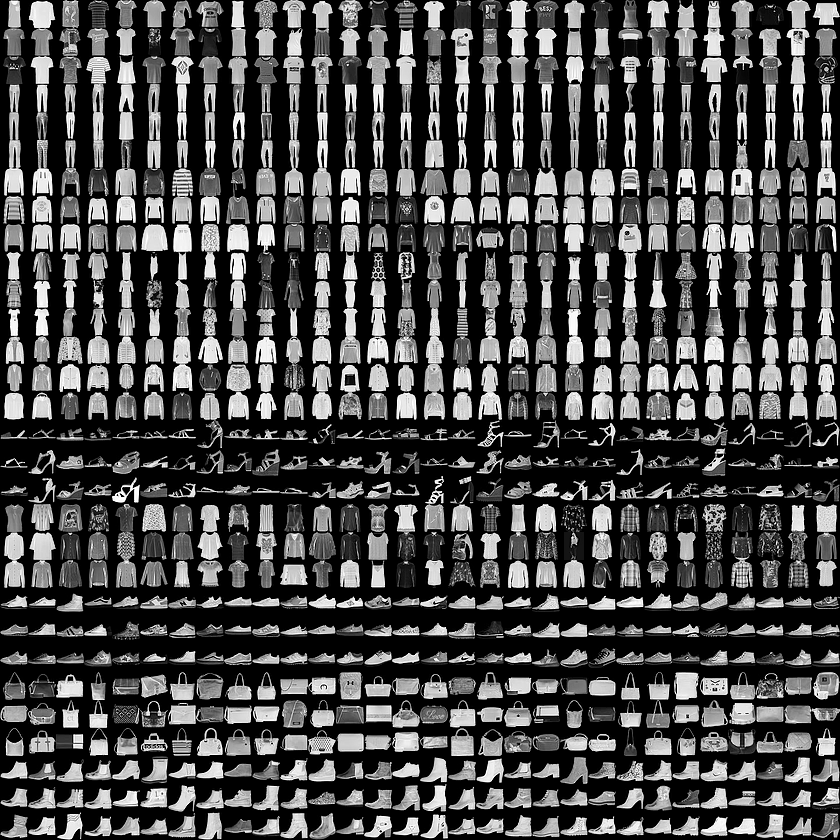
```

---

# Fashion MNIST data

```{r}
# loading the keras inbuilt fashion MNIST dataset
fashion_mnist <- dataset_fashion_mnist()

# retrieving train and test data
train_images <- fashion_mnist$train$x
train_labels <- fashion_mnist$train$y
test_images <- fashion_mnist$test$x
test_labels <- fashion_mnist$test$y
```

--

At this point we have four arrays: The `train_images` and `train_labels` arrays are the training data (i.e., the data the model uses to learn). The model is tested against the test set: the `test_images` and `test_labels` arrays. The images each are 28 x 28 arrays, with pixel values ranging between 0 and 255. The labels are arrays of integers, ranging from 0 to 9. These correspond to the class of clothing the image represents:

```{r}
class_names <- c(
  "T-shirt/top", "Trouser", "Pullover", "Dress", "Coat", 
  "Sandal", "Shirt", "Sneaker", "Bag", "Ankle boot"
  )
```

---

# Exploring the data

```{r}
# there are 60.000 images in the training set, with each image represented as 28 x 28 pixels
dim(train_images)
```

--

```{r}
# there are 60.000 labels
dim(train_labels)
```

--

```{r}
# each label is an integer between 0 and 9
train_labels[1:20]
```

---

# Exploring the data

```{r, out.width = "33%"}
# we rescale the image pixel values between 0 and 1
train_images <- train_images / 255
test_images <- test_images / 255

# plotting an item as an example
img <- train_images[1, , ]
img <- t(apply(img, 2, rev) )
image(x = 1:28, y = 1:28, z = img, col = gray((0:255) / 255), xaxt = "n", yaxt = "n")
```

---

# Defining a first model

```{r model1}
model <- keras_model_sequential() %>% # creating a model in sequential mode
  layer_flatten(input_shape = c(28, 28) ) %>% # 2d-array to 1d-array
  layer_dense(units = 128, activation = "relu") %>% # densely-connected layer
  layer_dropout(rate = 0.3) %>% # using dropout to reduce overfitting
  layer_dense(units = 10, activation = "softmax") # predicting the class probability
```

The first layer in this network, `layer_flatten()`, transforms the format of the images from a 2d-array (of 28 by 28 pixels), to a 1d-array of $28 \times 28 = 784$ pixels. Think of this layer as unstacking rows of pixels in the image and lining them up. This layer has no parameters to learn, it only reformats the data.

--

After the pixels are flattened, the network consists of a sequence of two dense layers. These are **densely-connected**, or **fully-connected**, neural layers. The first dense layer has 128 nodes (or neurons). The second (and last) layer is a 10-node softmax layer, which returns an array of 10 probability scores that sum to 1. Each node contains a score that indicates the probability that the current image belongs to one of the 10 digit classes.

---

# Defining a first model

```{r summary-model1}
summary(model)
```

---

# Compiling the model

The **loss function** measures how accurate the model is during training. We want to minimise this function to "steer" the model in the right direction. The **optimiser** specifies *how* the model is updated based on the data it sees and its loss function.

```{r compile-model1}
model %>% compile(
  loss = "sparse_categorical_crossentropy", # loss function to be minimised
  optimizer = "adam", # how the model is updated
  metrics = "accuracy" # used to monitor the training
  )
```

---

# Training the model

We train the model using the training data, for 10 epochs and by keeping 20% of the training set for validation.

```{r train-model1}
history <- model %>% fit(
  x = train_images,
  y = train_labels,
  epochs = 10,
  validation_split = 0.2,
  verbose = 2
  )
```

---

# Plotting the training history

```{r predict-model1, out.width = "75%", fig.asp = 0.5}
plot(history)
```

---

# Evaluating accuracy

We then evaluate the accuracy of the predictions on the testing data.

```{r, eval = TRUE}
model %>% evaluate(test_images, test_labels)
```

---

# Making predictions

With the model trained, we can use it to make predictions about some images from the testing dataset.

```{r, eval = TRUE}
# predicts the softmax prob
predictions <- model %>% predict(test_images)

# array of then probs (one for each class)
predictions[1, ]

# which class has the maximum prob
which.max(predictions[1, ])

# directly predicts the class
class_pred <- model %>% predict_classes(test_images)
class_pred[1:20]
```

---

# Making predictions

Let's plot several test images with their predicted class. Correct prediction labels are green and incorrect prediction labels are red.

```{r, eval = TRUE, echo = FALSE, fig.width = 12, fig.height = 8, out.width = "66%"}
par(mfcol = c(4, 6) )
par(mar = c(0, 0, 1.5, 0), xaxs = "i", yaxs = "i")

for (i in 1:24) {
  
  img <- test_images[i, , ]
  img <- t(apply(img, 2, rev) )
  
  # subtracts 1 as labels go from 0 to 9
  predicted_label <- which.max(predictions[i, ]) - 1
  true_label <- test_labels[i]
  
  if (predicted_label == true_label) {
    color <- "#008800"
  } else {
    color <- "#bb0000"
  }
  image(
    1:28, 1:28, img, col = gray((0:255) / 255),
    xaxt = 'n', yaxt = 'n',
    main = paste0(
      class_names[predicted_label + 1], " (",
      class_names[true_label + 1], ")"
      ),
    col.main = color
    )
}
```

---

# Making predictions

Finally, we use the trained model to make a prediction about a single image.

```{r, eval = TRUE}
# picks an image from the test dataset (pay attention to the batch dimension)
img <- test_images[1, , , drop = FALSE]
dim(img)

# directly retrieves the predicted class
class_pred <- model %>% predict_classes(img)
class_pred

# retrieves the corresponding label
class_names[class_pred + 1]
```

---
class: middle, center

# Worked example #2: Surface EMG signals classification using a 1d CNN

---

# Importing data

Importing the data from [Nalborczyk et al. (2020, PLOS ONE)](https://journals.plos.org/plosone/article?id=10.1371/journal.pone.0233282).

```{r}
# loading input features
x_reshaped <- readRDS("data/x.rds")

# (6 reps x 20 words x 22 participants) x 1 sec x 2 muscles
dim(x_reshaped)

# loading labels
y <- readRDS("data/y.rds")

# 6 reps x 20 words x 22 participants
length(y)
```

---

# Visualising the EMG data

For each trial (1 sec), we have the EMG amplitude recorded over two facial muscles: the orbicularis oris inferior (OOI) and the zygomaticus major (ZYG) muscles.

```{r emg, echo = FALSE, fig.asp = 0.5, out.width = "75%"}
data.frame( # visualising data from one trial
  sample = 1:1000,
  ooi = x_reshaped[, , 1][3, ],
  zyg = x_reshaped[, , 2][3, ]
  ) %>%
  pivot_longer(cols = ooi:zyg, names_to = "muscle", values_to = "EMG") %>%
  ggplot(aes(x = sample, y = EMG, colour = muscle) ) +
  geom_line(show.legend = FALSE) +
  facet_wrap(~muscle, scales = "free") +
  theme_bw(base_size = 12)
```

---

# Visualising the EMG data

```{r, echo = FALSE, fig.align = "center", out.width = "50%"}
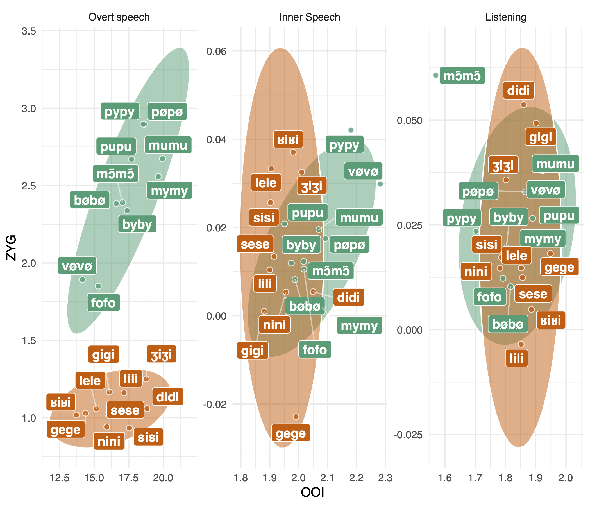
```

---

# Reshaping the data

```{r}
# train/test split (80%)
b <- 0.8 * nrow(x_reshaped)
x_train <- x_reshaped[1:b, , ]
x_test <- x_reshaped[(b + 1):nrow(x_reshaped), , ]
c(dim(x_train), dim(x_test) )

# dummy encoding of labels
num_classes <- n_distinct(y) %>% as.numeric
y_categ <- to_categorical(y = y, num_classes = num_classes)

# train/test split
y_train <- y_categ[1:b, ]
y_test <- y_categ[(b + 1):nrow(y_categ), ]
```

---

# Creating the model

```{r}
# input_shape should be [samples, time_steps, features]
model <- keras_model_sequential()

model %>%
    layer_conv_1d(
        filters = 40, kernel_size = 10, strides = 2,
        padding = "same", activation = "relu",
        input_shape = c(dim(x_reshaped)[2], dim(x_reshaped)[3])
        ) %>%
    layer_dropout(rate = 0.2) %>%
    layer_max_pooling_1d(pool_size = 3) %>%
    layer_conv_1d(
        filters = 32, kernel_size = 5, strides = 2,
        padding = "same", activation = "relu"
        ) %>%
    layer_dropout(rate = 0.2) %>%
    layer_max_pooling_1d(pool_size = 3) %>%
    layer_global_max_pooling_1d() %>%
    layer_dense(units = 64, activation = "relu") %>%
    layer_dropout(rate = 0.3) %>% 
    layer_dense(units = num_classes, activation = "softmax")
```

---

# Creating the model

```{r}
summary(model)
```

---

# Fitting the model

```{r compile-model2}
model %>%
    compile(
        loss = "categorical_crossentropy",
        optimizer = "adam",
        metrics = c("accuracy")
        )
```

```{r history-model2}
history <- model %>%
    fit(
        x_train, y_train,
        epochs = 20,
        batch_size = 10,
        validation_split = 0.2,
        # callbacks = list(
        #     callback_early_stopping(monitor = "val_loss", patience = 10, verbose = 1)
        #     )
        )
```

---

# Plotting the evolution of loss during training

```{r, out.width = "75%", fig.asp = 0.5}
plot(history)
```

---

# Assessing the fit

```{r}
# evaluating the model's predictions
model %>% evaluate(x_test, y_test)
```

```{r}
# making predictions
predictions <- model %>% predict_classes(x_test)

# confusion matrix
table(target = y[(b + 1):nrow(y_categ)], prediction = predictions)
```

---

# Extra utilities

```{r, eval = FALSE}
# saving the entire model (weights)
save_model_hdf5(model, "models/emg_1d_cnn_model_overt.h5")
loaded_model <- load_model_hdf5("models/emg_1d_cnn_model_overt.h5")

# saving JSON config
json_config <- model_to_json(model)
writeLines(json_config, "models/emg_1d_cnn_model_config_overt.json")
```

---

# References and further resources

The surface EMG data and some R code: https://github.com/lnalborczyk/surface_emg_cnn

Introduction to deep learning (full course): https://introtodeeplearning.com

Introduction to deep learning (full course): https://sebastianraschka.com/resources/dl-lectures/

RStudio tutorial: https://tensorflow.rstudio.com/tutorials/beginners/basic-ml/tutorial_basic_classification/

Another RStudio tutorial: https://blog.rstudio.com/2018/09/12/getting-started-with-deep-learning-in-r/

Deep learning in R (book): https://www.amazon.com/Deep-Learning-R-Francois-Chollet/dp/161729554X

A great introduction to deep learning in R: https://github.com/rstudio-conf-2020/dl-keras-tf

---

# Take-home messages

<!--
<link rel="stylesheet" href="http://maxcdn.bootstrapcdn.com/font-awesome/4.3.0/css/font-awesome.min.css">
<link rel="stylesheet" href="https://cdn.rawgit.com/jpswalsh/academicons/master/css/academicons.min.css">

<link rel = "stylesheet" href = "css/font-awesome.css"/>
<link rel = "stylesheet" href = "css/academicons.css"/>
-->

* **Deep learning**: A class of machine learning algorithms that use multiple layers to progressively extract higher-level features from the raw input (definition taken from the [Wikipedia](https://en.wikipedia.org/wiki/Deep_learning) article).

* **The universal approximation theorem**: A network with at least one hidden layer can approximate any continuous function.

* **The Keras framework**: User-friendly high-level interface to Tensorflow, available in Python and R.

<br>

&nbsp; `r icons::fontawesome("twitter")` [lnalborczyk](https://twitter.com/lnalborczyk) &nbsp; `r icons::fontawesome("github")` [lnalborczyk](https://github.com/lnalborczyk) &nbsp; `r icons::academicons("osf")` [https://osf.io/ba8xt](https://osf.io/ba8xt) &nbsp; `r icons::fontawesome("globe")` [www.barelysignificant.com](https://www.barelysignificant.com)
